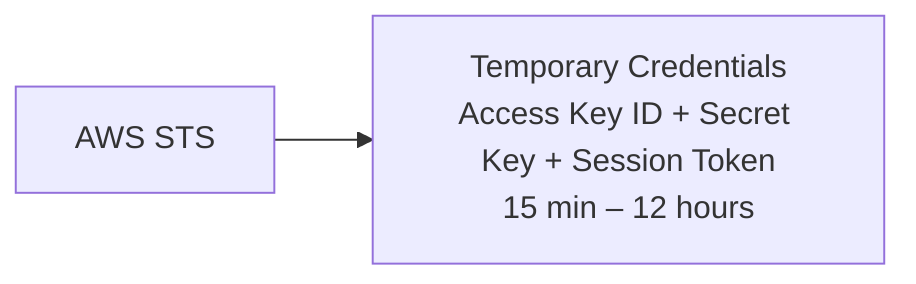
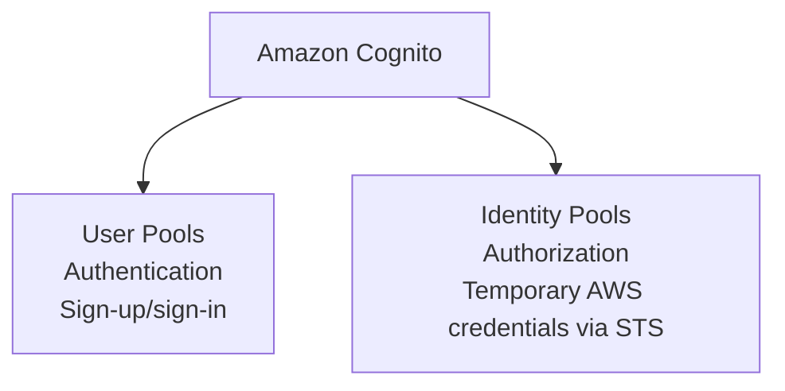
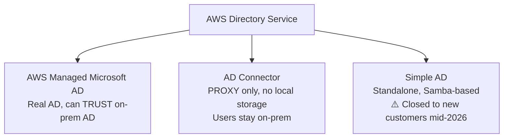
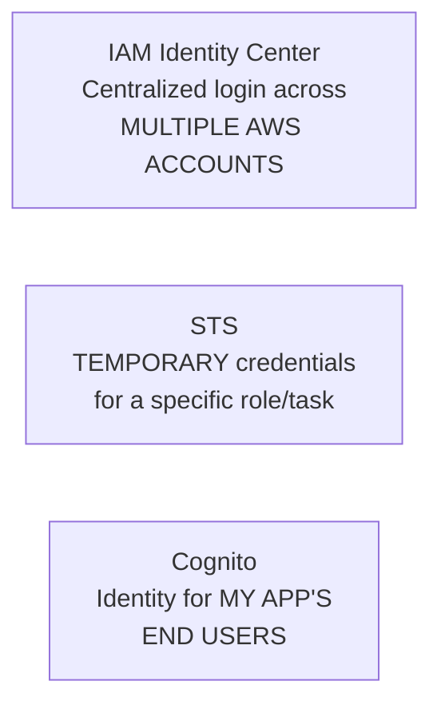
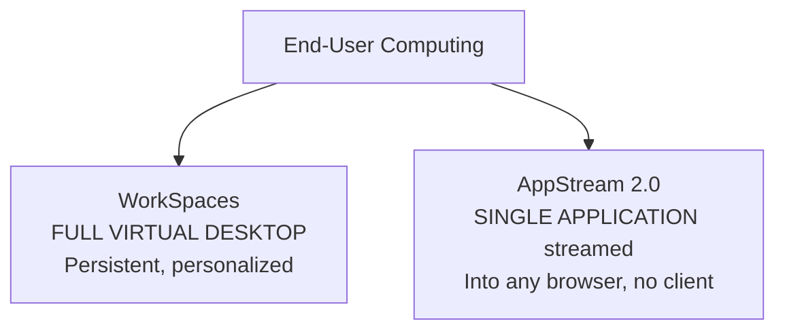

# Module 10 (Part 1): Identity Services, End-User Computing & App Development — Study Summary

---

# PART A: Identity & Directory Services

## 1. AWS STS (Security Token Service)

- Creates **temporary security credentials** instead of long-lived IAM user credentials
- **Core use cases:**
  1. Assuming an IAM role (same-account or cross-account)
  2. **Identity federation** — corporate directory/Google/Facebook sign-in via SAML or OIDC
  3. Granting EC2/Lambda temporary access via instance profile/execution role
- **Free, global service**

> **⚠️ Exam tip:** "Temporary credentials that expire" or "cross-account access without sharing long-term keys" → **STS**

---

## 2. Amazon Cognito

- Manages sign-up/sign-in/access control for **your own app's end users** (millions of users)
- Supports social IdPs (Google, Facebook, Amazon) + enterprise SAML/OIDC, MFA, adaptive auth

> **⚠️ Exam tip — IAM vs. Cognito:**
> - **IAM** = access for YOUR AWS environment (employees, services)
> - **Cognito** = identity for the **users of the application you built**
> - **Anti-pattern:** never create individual IAM users for app end users

---

## 3. Microsoft Active Directory (AD) — Background

- **AD DS** = Windows Server role providing directory services (database of users, computers, printers, security groups)
- Enables centralized security management for corporate Windows environments
- AWS offers ways to bring AD to the cloud (see Directory Service below) instead of running your own domain controllers on EC2

---

## 4. AWS Directory Service — 3 Options

| Option | What It Is | Syncs with On-Prem AD? |
|---|---|---|
| **AWS Managed Microsoft AD** | Real Microsoft AD, AWS-managed domain controllers; supports Group Policy, LDAP, Kerberos | ✅ Trust relationship |
| **AD Connector** | Proxy/gateway redirecting auth to on-prem AD; stores no users itself | ✅ Proxy (nothing duplicated) |
| **Simple AD** | Standalone AD-compatible (Samba-based, NOT real AD); for WorkSpaces/basic LDAP | ❌ Cannot trust on-prem AD |

> **⚠️ Status update:** As of mid-2026, **Simple AD closed to new customers** (maintenance mode). New builds → Managed Microsoft AD or AD Connector.
> **⚠️ Exam differentiator:** "Does this need to sync with our on-prem AD?" → Managed Microsoft AD (trust) or AD Connector (proxy); Simple AD does NOT connect to on-prem.

---

## 5. AWS IAM Identity Center

- Current name for what was **AWS Single Sign-On (AWS SSO)** — renamed 2022
- **One login** for all AWS accounts under AWS Organizations, using centrally-defined **permission sets**
- Also SSO for business apps (Salesforce, Box, Microsoft 365) via SAML 2.0
- Identity sources: built-in directory, or external (AD, Okta, Entra ID, OneLogin)
- **Free to use**

### Identity Services Comparison

> **⚠️ Exam tip:**
> - "Centralized login across multiple AWS accounts" / "permission sets" → **IAM Identity Center**
> - "Temporary credentials for a specific task/role" → **STS**
> - "My app's end users" → **Cognito**

---

# PART B: End-User Computing

## 6. Amazon WorkSpaces vs. AppStream 2.0 — ⭐ Critical Comparison

| | **WorkSpaces** | **AppStream 2.0** |
|---|---|---|
| Delivers | **Entire persistent desktop** (Windows/Amazon Linux) | **Single application**, streamed pixel-by-pixel |
| Best for | Complete workstation experience — own files, multiple apps | Access to ONE app, no local install |
| Client needed | Yes (desktop client or browser) | No — standard web browser only |
| Pricing | Monthly (fixed) or hourly | Per-instance-hour |
| Management burden | Eliminates on-prem VDI patching/capacity planning | No device management for AWS |

> **⚠️ Anti-pattern:** If a question only needs "access to one application" → **AppStream 2.0** is the lean answer; WorkSpaces is overkill.
> **Exam cue:** "Remote employees need a full desktop experience, centrally managed" → WorkSpaces. "Give contractors temporary access to one licensed app" → AppStream 2.0.

---

# PART C: IoT & Application Development Services

## 7. AWS IoT Core

- Connects **IoT devices** (sensors, appliances, industrial equipment) to AWS Cloud
- Serverless, secure, scales to **billions of devices, trillions of messages**
- Lightweight protocols: **MQTT, HTTPS, LoRaWAN** (low bandwidth/battery)
- **Device Shadow** — cached representation of device's last known state, works even while device is offline
- Routes data to Lambda, S3, DynamoDB, Kinesis, SageMaker

> **⚠️ Exam tip:** "Device fleets sending telemetry from the field" (factory sensors, connected vehicles) → **IoT Core**

---

## 8. AWS AppSync

- Fully managed service for building **GraphQL and Pub/Sub APIs** with real-time sync
- **GraphQL**: client requests exactly the fields it needs in one request (vs. multiple REST round-trips)
- Resolvers connect schema to DynamoDB, Lambda, Aurora, OpenSearch (one API, multiple backends)
- Built-in **real-time subscriptions** over WebSockets (chat apps, live dashboards)
- Supports offline sync for unreliable connections
- **AppSync Events** — newer WebSocket Pub/Sub capability without a GraphQL schema

> **⚠️ Exam tip:** "GraphQL API" or "real-time data sync for mobile apps" → **AppSync**; plain "REST API" → **API Gateway**

---

## 9. AWS Amplify

- Toolkit for building/hosting full-stack web & mobile apps — for front-end/mobile developers
- Pre-built blocks: auth (Cognito), storage, APIs (often via AppSync), CI/CD hosting, analytics, AI/ML
- Git-based CI/CD: push code to GitHub/GitLab/Bitbucket → Amplify builds/deploys automatically

> **⚠️ Exam tip:** Amplify = "front-end developer's fast path" — stitches together Cognito, AppSync, S3, etc. rather than being its own standalone service.

---

## 10. AWS Application Composer

- **Visual, drag-and-drop tool** for designing serverless architectures
- Generates the underlying **CloudFormation/SAM template** in real time as you connect resources
- Supports importing existing templates to visualize/continue editing

> **⚠️ Exam tip:** Application Composer is a **design/authoring aid** — it doesn't replace CloudFormation, it **generates** CloudFormation.

---

## 11. AWS Device Farm

- Tests web/mobile apps against **real physical devices** and browsers (not just simulators)
- Runs tests concurrently across many devices; configures GPS, locale, Wi-Fi/cellular, Bluetooth conditions

> **⚠️ Exam tip:** "Testing an app across many real device/OS/browser combos before release" → **Device Farm** (not CodeBuild/CodePipeline, which build/deploy rather than test on physical devices)

---

## Quick Reference — Part 1 Exam Anchors

| If the question says... | Think... |
|---|---|
| "Temporary credentials that expire" | STS |
| "Identity for my app's end users" | Cognito |
| "Never create IAM users for customers" | Correct — use Cognito instead |
| "Real AD with Group Policy/LDAP/Kerberos in AWS" | AWS Managed Microsoft AD |
| "Proxy auth to existing on-prem AD, no local storage" | AD Connector |
| "Basic directory, no on-prem sync needed" | Simple AD (⚠️ now closed to new customers) |
| "Centralized login across multiple AWS accounts" | IAM Identity Center |
| "Full persistent virtual desktop" | WorkSpaces |
| "Stream a single app to a browser" | AppStream 2.0 |
| "IoT device fleet sending telemetry" | IoT Core |
| "GraphQL API with real-time sync" | AppSync |
| "Front-end dev needs quick full-stack backend" | Amplify |
| "Visual drag-and-drop serverless design tool" | Application Composer |
| "Test app on real physical devices/browsers" | Device Farm |
