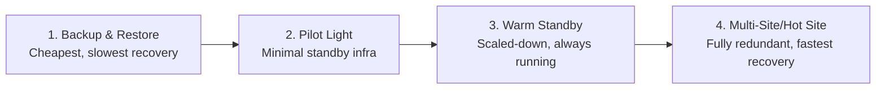
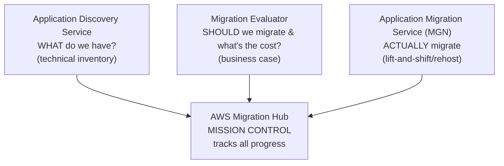
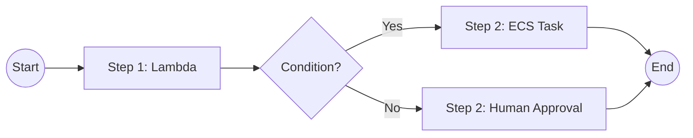

# Module 10 (Part 2): Backup, Disaster Recovery, Migration & Orchestration — Study Summary

---

# PART A: Backup & Disaster Recovery

## 1. AWS Backup

- Fully managed service that **centralizes/automates backups** across AWS services (EBS, RDS, DynamoDB, EFS, FSx, Storage Gateway, etc.) from **one console**
- On-demand + scheduled backups via **backup plans**
- Supports **Point-in-Time Recovery (PITR)** for DynamoDB, RDS/Aurora
- Retention/lifecycle rules — e.g., auto-transition old backups to cold storage
- Cross-Region and cross-account backup copies (via Organizations)

> **⚠️ Exam tip:** "Backing up several different AWS resource types under one consistent, centrally managed policy" → **AWS Backup**, not manual per-service snapshots.

---

## 2. Disaster Recovery Strategies — 4 Approaches

| Strategy | Description | Cost | Recovery Speed |
|---|---|---|---|
| **1. Backup and Restore** | Regular backups; restore on failure | Lowest | Slowest |
| **2. Pilot Light** | Minimal version of infra (e.g., DB) always on standby; scale up on disaster | Low | Moderate |
| **3. Warm Standby** | Scaled-down but **fully functional** copy always running; scale up to full capacity | Medium | Faster than Pilot Light |
| **4. Multi-Site/Hot Site** | Fully redundant, active secondary site in different geography | Highest | Fastest, minimal downtime |

> **Trade-off:** Cost increases as you move down the list, but so does recovery speed and resilience.

---

## 3. AWS Elastic Disaster Recovery (DRS)

- Built on **CloudEndure Disaster Recovery** technology, AWS-acquired and evolved
- Recovers physical, virtual, and cloud-based servers into AWS after data loss/disaster
- Uses **continuous, block-level replication** to a low-cost staging area
- **In effect, automates a Pilot Light → rapid launch pattern**: keeps minimal infra warm, spins up full recovery instances only when launched

> **⚠️ Exam tip:** DRS = AWS's purpose-built, minimal-effort answer for **near-continuous DR** for on-premises or cross-Region servers, without building a custom replication pipeline.

---

# PART B: Migration Services

## 4. AWS DataSync

- Automates/accelerates transfer of large data between **on-premises ↔ AWS** or **AWS ↔ AWS**
- Targets: **S3, EFS, FSx** (Windows, Lustre, OpenZFS, NetApp ONTAP)
- Scheduled or on-demand tasks; **incremental transfers** after first full copy (only changed data moves)

> **⚠️ Exam tip:** DataSync moves **files and objects** — NOT for block-level server replication (that's **DRS/MGN**) or continuous database replication (that's **DMS**, from Module 6).

---

## 5. The Migration Toolkit — 4 Services Working Together

### AWS Application Discovery Service
- Collects data about existing on-prem servers/apps **before** migrating
- **Agentless discovery** — VM inventory via discovery connector (e.g., against VMware), no install
- **Agent-based discovery** — lightweight agent for deeper detail (processes, network connections, dependencies)
- Data flows into **AWS Migration Hub**

> **Exam cue:** "We don't know what's running in our data center" → **Application Discovery Service** (first step)

### AWS Application Migration Service (MGN)
- AWS's primary **lift-and-shift (rehost)** service
- Continuously replicates source servers to AWS → converts to boot/run natively on EC2 at cutover
- Supports broad range of platforms/OS/databases without rearchitecting
- Minimal downtime during cutover

> **⚠️ MGN vs. DRS:** They **share the same underlying replication technology**.
> - **MGN** = planned, **one-time migration**
> - **DRS** = ongoing **disaster recovery readiness**

### AWS Migration Evaluator
- Builds a **data-driven business case** for migrating to AWS
- Installs an **Agentless Collector** — captures server footprint/utilization/dependencies
- Produces cost projections for executive buy-in

> **⚠️ Exam distinction:**
> - **Migration Evaluator** = business case / cost ("should we migrate, what will it cost?")
> - **Application Discovery Service** = technical inventory ("what do we actually have?")
> - Often used together, but answer different questions

### AWS Migration Hub
- **Single dashboard** tracking migration progress across multiple AWS/partner tools
- Doesn't migrate itself — aggregates status from Discovery Service, Migration Evaluator, MGN
- **Migration Hub Orchestrator** — pre-built workflow templates for complex enterprise migrations (SAP, SQL Server)

> **⚠️ Exam tip:** Migration Hub = "mission control" view — for scenarios needing visibility into migration progress across many servers/apps/accounts.

---

# PART C: Orchestration

## 6. AWS Step Functions

- Builds serverless **visual workflows (state machines)** to orchestrate multiple AWS services
- Features: sequential steps, parallel branches, conditional logic, timeouts, retries, structured error handling
- Integrates with: Lambda, EC2, ECS/Fargate, DynamoDB, SNS, SQS, API Gateway, Glue, SageMaker, even on-prem via API
- Supports **human approval steps** (waiting for callback)

**Use cases:** order fulfillment pipelines, ETL pipelines, multi-step business processes

> **⚠️ Exam tip:** "Orchestrate multiple steps/services with visual workflow, retries, error handling" → **Step Functions**. A single standalone piece of code in response to an event = just **Lambda**; Step Functions coordinates many steps together.

---

## Quick Reference — Part 2 Exam Anchors

| If the question says... | Think... |
|---|---|
| "Centrally manage backups across EBS/RDS/DynamoDB/EFS" | AWS Backup |
| "Cheapest DR strategy, slowest recovery" | Backup and Restore |
| "Minimal standby infra, scale up on disaster" | Pilot Light |
| "Scaled-down but always running, faster recovery" | Warm Standby |
| "Fully redundant secondary site, fastest recovery" | Multi-Site/Hot Site |
| "Near-continuous DR without custom replication" | Elastic Disaster Recovery (DRS) |
| "Move files/objects between on-prem and AWS" | DataSync |
| "Move block-level server replicas" | DRS or MGN (not DataSync) |
| "We don't know what's in our data center" | Application Discovery Service |
| "Should we migrate, what will it cost?" | Migration Evaluator |
| "Lift-and-shift servers to EC2" | Application Migration Service (MGN) |
| "Single dashboard tracking all migration progress" | Migration Hub |
| "Orchestrate multi-step workflow with retries" | Step Functions |
