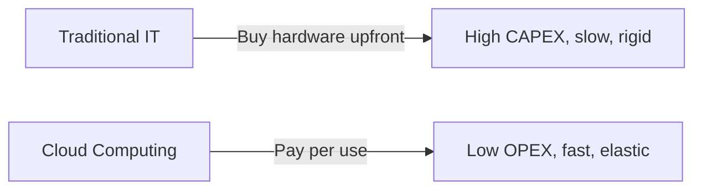
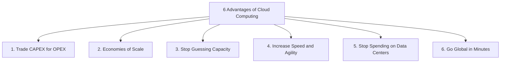
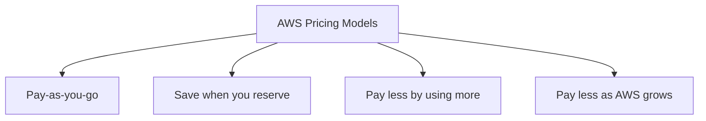
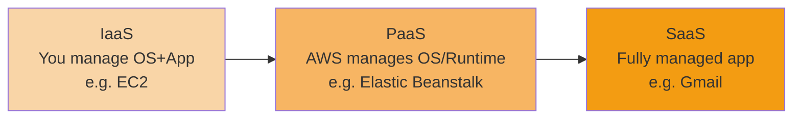
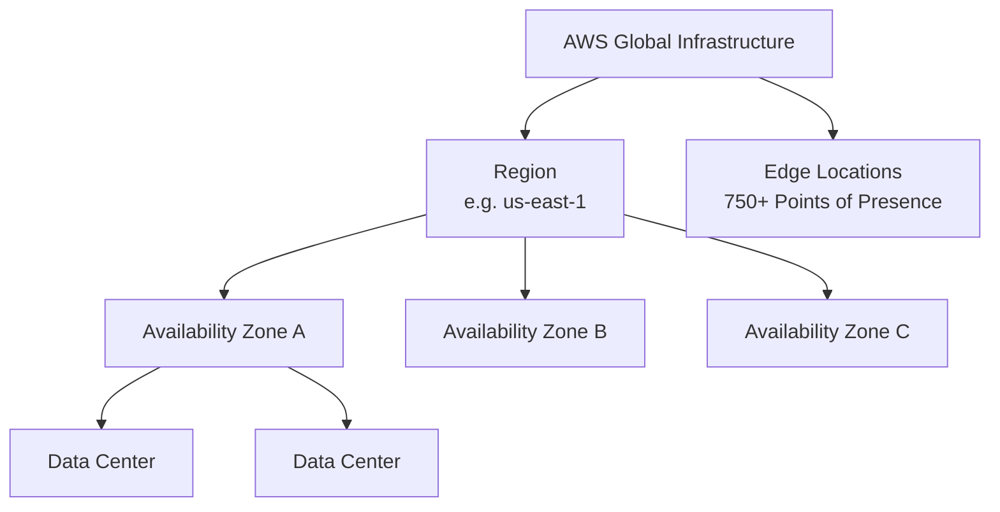
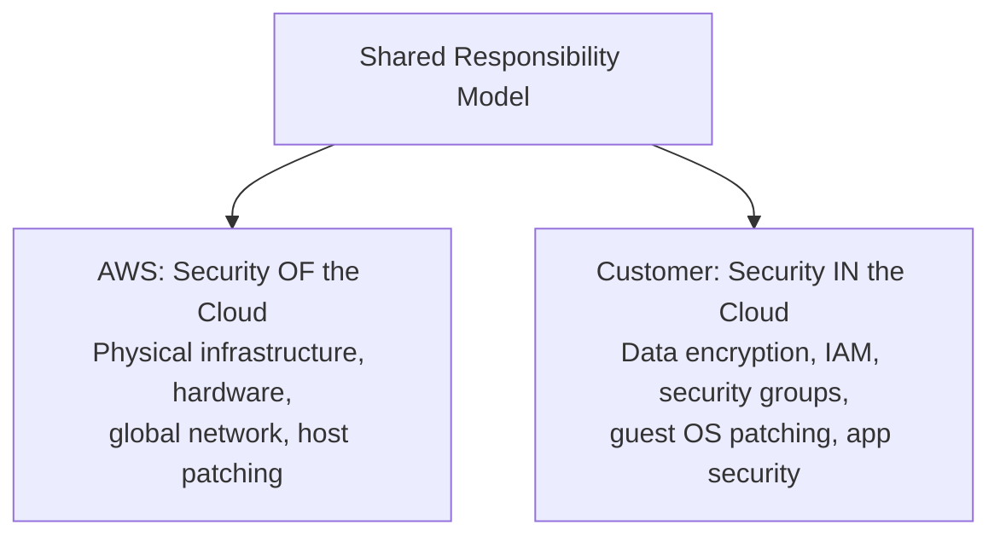
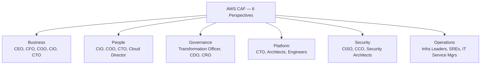
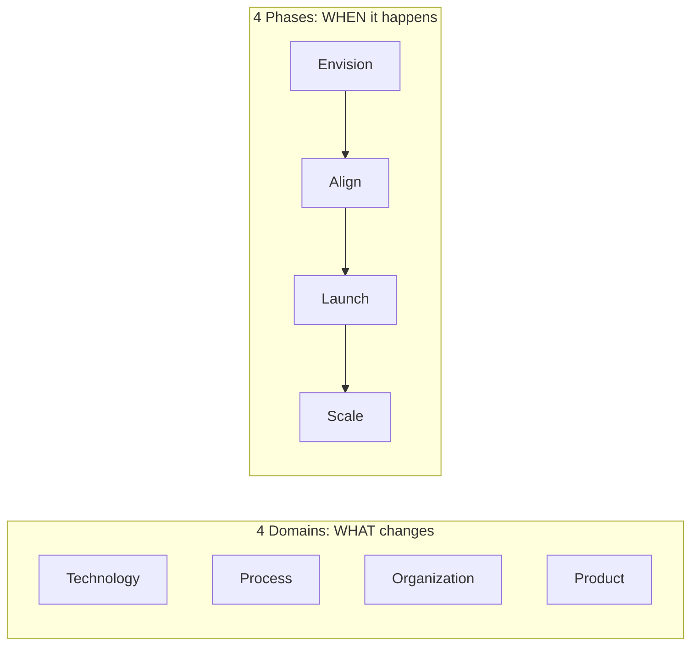

# Module 1: AWS Cloud Fundamentals — Complete Study Summary

---

## 1. Introduction to AWS and Cloud Computing

- **AWS (Amazon Web Services)** launched in **2006** with two founding services:
  - **Amazon S3** (Storage)
  - **Amazon EC2** (Compute)
- Grew out of infrastructure Amazon.com built for its own e-commerce platform.
- Initial focus: **Infrastructure-as-a-Service (IaaS)**.

**Key milestones:**
| Year | Milestone |
|---|---|
| 2006 | S3 & EC2 launch |
| 2009 | Amazon RDS, Amazon VPC |
| 2011 | AWS Elastic Beanstalk |
| 2012 | DynamoDB, AWS Marketplace |
| 2014 | AWS Lambda (pioneered serverless) |
| 2015–present | Enterprise adoption accelerates; SageMaker, Aurora, Bedrock launch |

> **Exam Tip:** Remember S3 and EC2 as the founding pair (storage vs. compute) — exact dates are not tested.

Today: **200+ services**, world's largest cloud provider, global infrastructure spanning **39+ Regions**.

---

## 2. Why Cloud Computing?

### Problems with Traditional (On-Premises) IT
- Data center rental costs
- Power, cooling, maintenance expenses
- Slow hardware provisioning (weeks)
- Limited scalability
- Need for 24/7 monitoring staff
- Disaster preparedness burden (earthquakes, power outages, fires)

### Cloud Computing Definition
> On-demand delivery of compute power, database storage, applications, and other IT resources, with **pay-as-you-go pricing**.

**Core benefits:**
- **Pay-as-you-go** — no upfront commitment
- **Precise resource provisioning** — scale up/down instead of over-buying
- **Virtually unlimited resources on demand** — minutes instead of weeks
- **Convenient self-service access** — via console, CLI, or API

> **Exam Tip:** Key terms — "on-demand," "pay-as-you-go," "elasticity" — signal cloud computing's core nature.

---

## 3. The 6 Advantages of Cloud Computing (AWS's Official List)

These appear almost word-for-word as exam answer choices.

| # | Advantage | Meaning |
|---|---|---|
| 1 | **Trade capital expense for variable expense** | No large upfront investment; pay only for compute used → lowers TCO |
| 2 | **Benefit from massive economies of scale** | AWS aggregates usage across millions of customers → lower prices |
| 3 | **Stop guessing capacity** | Scale based on actual measured demand, not forecasts |
| 4 | **Increase speed and agility** | New resources available in minutes, not weeks |
| 5 | **Stop spending money running data centers** | Focus on business-differentiating work |
| 6 | **Go global in minutes** | Deploy to multiple Regions worldwide with a few clicks |

> **Example:** A startup deploys its app to Regions in Singapore, Frankfurt, and Virginia — instead of leasing physical data centers in each location = "Go Global in Minutes."

---

## 4. AWS Pricing Models

| Model | Description | Example |
|---|---|---|
| **Pay-as-you-go** | No upfront cost, pay for actual usage | On-Demand EC2 billed per second |
| **Save when you reserve** | Commit 1–3 years for discounts up to ~72% | Reserved Instances, Savings Plans |
| **Pay less by using more** | Volume-based tiered discounts | S3 storage tiers, data transfer |
| **Pay less as AWS grows** | AWS historically passes savings to customers | Price cuts since 2006 |

> Reserved Instances suit **steady, predictable workloads** (e.g., a 24/7 database) — NOT spiky or short-lived workloads.
> **Spot Instances** (not one of the 4 official pricing models but tested): up to 90% off, for interruptible workloads.

---

## 5. Cloud Deployment Models

*(Where the infrastructure physically lives)*

| Model | Description | Example |
|---|---|---|
| **Private Cloud** | Dedicated to a single organization; full control, high security | Bank keeping transaction systems on-premises |
| **Public Cloud** | Third-party owned (AWS); shared physical infra, logically isolated data | Startup running entirely on AWS |
| **Hybrid Cloud** | Combines private + public | Hospital keeps patient records on-prem, bursts analytics to AWS |

---

## 6. Cloud Service Models (IaaS / PaaS / SaaS)

*(How much AWS manages vs. how much you manage)*

| Model | You Manage | AWS Manages | Example |
|---|---|---|---|
| **IaaS** | OS, middleware, app | Hardware, networking | Amazon EC2 |
| **PaaS** | Code and data only | OS, runtime | AWS Elastic Beanstalk |
| **SaaS** | Nothing (just use it) | Everything | Gmail, Amazon Chime |

**Pizza analogy:**
- IaaS = buy ingredients, use your own kitchen
- PaaS = pizza kit delivered, you just bake it
- SaaS = pizza arrives ready to eat

> **Exam Tip:** As you move IaaS → PaaS → SaaS, AWS manages progressively more of the stack. Don't confuse **Deployment Models** (where infra lives) with **Service Models** (who manages what) — both are tested, often together.

---

## 7. AWS Global Infrastructure

### Current Scale (2026)
- **39+ Regions**
- **123+ Availability Zones**
- **750+ CloudFront Edge Locations / Points of Presence**
- **15 Regional Edge Caches**

### Regions
- A cluster of data centers in a geographic area (e.g., N. Virginia, Frankfurt, Singapore)
- **Fully isolated** from other Regions → gives fault tolerance
- Each Region has a **minimum of 3 Availability Zones**
- Region codes: `us-east-1`, `eu-west-3`, `ap-southeast-2`

**Choosing a Region — 4 criteria:**
1. **Compliance** — data residency laws
2. **Proximity** — reduce latency to users
3. **Service availability** — not all services in all Regions
4. **Pricing** — varies by Region

### Availability Zones (AZs)
- Isolated locations within a Region; one or more discrete data centers
- Own power, cooling, networking
- Physically separated (often tens of km apart)
- Connected via high-bandwidth, low-latency private links (fast enough for synchronous replication)
- **Deploying across multiple AZs = High Availability**
- Single AZ = single point of failure

### Edge Locations / Points of Presence (PoPs)
- Separate from Regions/AZs
- Used by **CloudFront** (CDN), Route 53, Global Accelerator, Shield/WAF
- Cache content close to users to reduce latency
- Far more numerous than Regions
- **Do NOT run EC2 instances or databases** — caching and content delivery only

### AWS Data Centers
- Managed by AWS staff, restricted access
- Compliant with industry security standards
- Redundant power/cooling, scalable, energy efficient

---

## 8. Global Infrastructure Use Cases
- **Decreased latency** — deploy closer to users
- **Disaster recovery** — failover to another Region
- **Attack protection** — distributed infrastructure is harder to attack

---

## 9. AWS Shared Responsibility Model

| AWS Responsibility ("OF" the Cloud) | Customer Responsibility ("IN" the Cloud) |
|---|---|
| Physical infrastructure & facilities | Data encryption |
| Hardware, software, networking | IAM permissions |
| Physical security & environmental controls | Security group / firewall rules |
| Patching the underlying host infrastructure | Guest OS patching (on EC2) |
| — | Application-level security |

> **Key exam anchor:** AWS secures **"of"** the cloud; customer secures **"in"** the cloud.
> The split shifts by service — more managed services (e.g., **RDS**, **S3**) = AWS handles more; **less managed** (e.g., EC2) = customer handles more.

---

## 10. AWS Cloud Adoption Framework (CAF)

- Structured guidance for cloud-driven digital transformation
- Maps ~47 organizational capabilities
- Organized into **6 Perspectives**

| Perspective | Focus | Key Stakeholders |
|---|---|---|
| **Business** | Align cloud investment with business outcomes | CEO, CFO, COO, CIO, CTO |
| **People** | Culture of continuous learning; change management | CIO, COO, CTO, Cloud Director, cross-functional leaders |
| **Governance** | Orchestrate initiatives, manage risk | Chief Transformation Officer, CIO, CTO, CFO, CDO, CRO |
| **Platform** | Build enterprise-grade scalable platform | CTO, Technology Leaders, Architects, Engineers |
| **Security** | Confidentiality, Integrity, Availability (CIA) | CISO, CCO, Internal Audit Leaders, Security Architects |
| **Operations** | Reliable day-to-day service delivery | Infrastructure/Operations Leaders, SREs, IT Service Managers |

> **Exam Tip:** Just know the 6 perspectives by name and match a stakeholder (e.g., CFO → Business, CISO → Security) — no need to memorize the 47 capabilities.

---

## 11. Cloud Transformation Value Chain

Two separate mental buckets — don't mix them up:

**4 Transformation Domains (WHAT changes):**
- **Technology** — migrate/modernize legacy infrastructure
- **Process** — digitize/automate operations (e.g., ML for fraud detection)
- **Organization** — reorganize teams around products (agile)
- **Product** — new value propositions and revenue models

**4 Transformation Phases (WHEN it happens):**
1. **Envision** — identify opportunities, build the case
2. **Align** — identify capability gaps across CAF Perspectives → produces an Action Plan
3. **Launch** — pilot initiatives in production
4. **Scale** — expand pilots to full business benefit

> **Critical distinction:**
> - **Perspectives** = WHO's involved (6)
> - **Domains** = WHAT's transforming (4)
> - **Phases** = WHEN it happens (4)

---

## 12. AWS Ecosystem

### Free Tools
| Tool | Purpose |
|---|---|
| AWS Blogs | Official updates & technical articles |
| AWS Forums → **AWS re:Post** | Community Q&A (crowd-sourced + expert-reviewed) |
| AWS Whitepapers & Guides | In-depth technical documentation |
| AWS Solutions Library (formerly "Quick Starts") | 1,300+ vetted deployable architectures |

### AWS re:Post
- Replaces the original AWS Forums
- Part of AWS Free Tier
- Members earn reputation points
- Premium Support customers: unanswered questions escalate to AWS Support engineers
- Not for time-sensitive or proprietary information
- **Knowledge Center** = most common questions/requests

### AWS Marketplace
- Digital catalog of software from third-party vendors + AWS Professional Services
- Includes: Custom AMIs, CloudFormation templates, SaaS offerings, container solutions, professional services
- Billed on your regular AWS invoice
- You can also **sell** your own solutions here

### AWS IQ — DISCONTINUED
- Was: connect customers with AWS Certified third-party experts for project work
- **Discontinued May 28, 2026**
- Replaced by: **AWS Marketplace Professional Services** (private offers, billed to AWS account)

### AWS Training
| Type | Description |
|---|---|
| Digital Training | Self-paced online courses |
| Classroom Training | Instructor-led (in-person/virtual) |
| Private Training | Customized for your organization |
| AWS Academy | Partnership with universities |
| Government/Enterprise Training | Specialized programs |

### AWS Professional Services & Partner Network (APN)
- **AWS Professional Services** = AWS's own expert team, works with a chosen APN partner
- **APN types:**
  - Technology Partners (hardware/software providers)
  - Consulting Partners (help build/deploy on AWS)
  - Training Partners (offer AWS training)
- **AWS Competency Program** — recognizes proven partner expertise
- **AWS Navigate Program** — helps partners develop their own skills

### AWS Managed Services (AMS)
- Team of AWS experts manages your infrastructure (security, reliability, availability)
- Fully managed: change requests, monitoring, patch management, security, backups
- Available **24/7/365**
- **Difference from Professional Services:** AMS = ongoing continuous operations; Professional Services = project-based engagement

---

## Quick Reference — Module 1 Exam Anchors

| If the question says... | Think... |
|---|---|
| "Storage vs. compute founding pair" | S3 & EC2 (2006) |
| "Pay only for what you use, no contracts" | On-demand / pay-as-you-go |
| "Deploy to multiple countries in minutes" | Go global in minutes |
| "24/7 predictable database workload" | Reserved Instances |
| "Data must stay in-country" | Compliance → Region choice |
| "App must survive one data center failure" | Multi-AZ deployment |
| "Who manages the OS on EC2?" | Customer (Shared Responsibility) |
| "Who manages the OS on RDS?" | AWS |
| "Match CFO to a CAF perspective" | Business |
| "Match CISO to a CAF perspective" | Security |
| "Deploying architectures with prebuilt templates" | AWS Solutions Library |
| "Find a certified expert for a one-off project" | AWS Marketplace Professional Services (AWS IQ is discontinued) |
