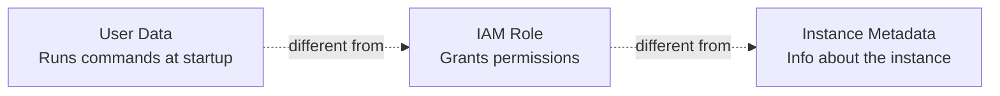
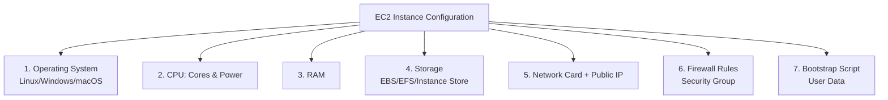
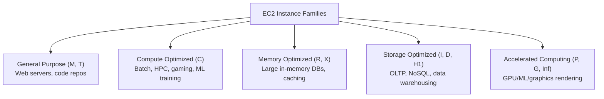
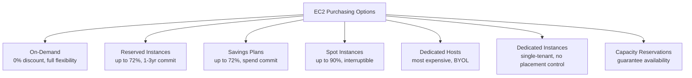
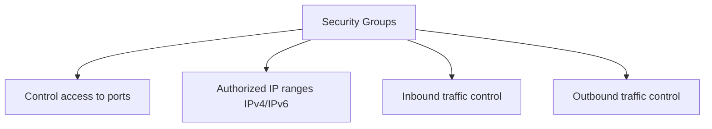
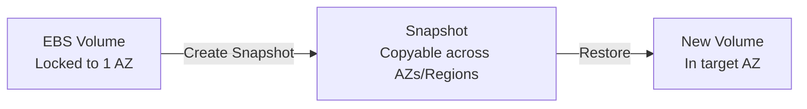
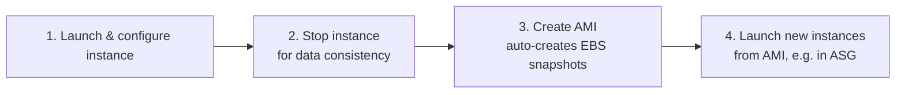
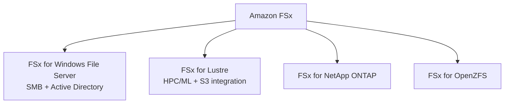

# Module 2: Amazon EC2 & Storage — Complete Study Summary

---

## 1. What is Amazon EC2?

- **EC2 (Elastic Compute Cloud)** = a virtual server (instance) running in AWS Cloud
- Instance type determines: **CPU, memory, storage, network capacity**
- Billed **per second (Linux)** or **per hour** — rent vs. buy physical servers
- EC2 = the textbook example of **IaaS**: AWS manages hardware/virtualization; you manage OS/runtime/app

> **Exam Tip:** "Full control over OS + AWS manages hardware" → EC2/IaaS (not Lambda/RDS)

### EC2 Capabilities
- Wide range of instance types for different use cases
- Related components: **EC2** (compute), **EBS** (storage), **ELB** (load balancing), **ASG** (auto scaling)
- Flexible scaling for cost/performance optimization

### ⚠️ Anti-patterns — when EC2 is NOT the answer
| Scenario | Correct Answer |
|---|---|
| Zero server management needed | **Lambda** |
| Object storage/retrieval (not running OS) | **S3** |

**Signal words for EC2:** "provisioning," "patching the OS," "choosing an instance type"

### User Data Script
- Configures EC2 at **launch** ("bootstrapping")
- Runs **only once**, on first boot (not on every reboot, unless configured)
- Runs with **root/administrator privileges**
- Used for: installing software, downloading files, running config commands

> ⚠️ These 3 concepts are frequently tested together in the same question.

---

## 2. EC2 Sizing & Configuration — 7 Key Elements

---

## 3. EC2 Instance Types & Naming Convention

**Example:** `m6g.2xlarge`
- `m` = instance family
- `6` = generation number (higher = newer, better price-performance)
- `g` = optional attribute (g=Graviton/ARM, n=network optimized, d=local NVMe)
- `2xlarge` = size within family

### 5 Main Instance Families

| Family | Best For |
|---|---|
| **General Purpose** (M, T) | Web servers, code repos — balanced resources |
| **Compute Optimized** (C) | Batch processing, HPC, ML/scientific modeling, gaming servers |
| **Memory Optimized** (R, X) | Large in-memory databases, distributed caching, BI |
| **Storage Optimized** (I, D, H1) | High-frequency OLTP, NoSQL, data warehousing |
| **Accelerated Computing** (P, G, Inf/Trn) | ML training/inference, graphics rendering, HPC |

> **⚠️ Exam Tip:** "GPU" or "machine learning workload" → **Accelerated Computing** (P, G, Inf), NOT Compute Optimized (C = general high-vCPU processing).

---

## 4. AWS Right Sizing

- Matching instance type/size to workload requirements for optimal performance + cost
- Best practice: **start small**, scale up as needed
- Do it **before migration** AND **continuously afterward** (needs change over time)

| Tool | Role |
|---|---|
| **AWS Compute Optimizer** | ML on CloudWatch metrics → recommends EC2/EBS/Lambda/ASG configs; flags over/under-provisioned |
| **CloudWatch** | Provides raw utilization metrics |
| **Cost Explorer** | Rightsizing recommendations focused on cost savings |
| **Trusted Advisor** | Flags low-utilization instances |

> **Exam Tip:** "Automated recommendations to resize EC2 based on utilization" → **AWS Compute Optimizer**

---

## 5. EC2 Purchasing Options — Full Comparison

| Option | Discount | Commitment | Best Trait |
|---|---|---|---|
| **On-Demand** | 0% | None | Full flexibility, unpredictable workloads |
| **Reserved Instances** | Up to 72% | 1-3yr, specific instance | Deepest discount, locked config |
| **Savings Plans** | Up to 72% | 1-3yr, $/hour spend | Flexible across families/services |
| **Spot Instances** | Up to 90% | None (interruptible) | Cheapest, 2-min interruption warning |
| **Dedicated Hosts** | Up to 70% (reserved) | Physical server, full control | Needed for per-socket/core BYOL licensing |
| **Dedicated Instances** | Cheaper than Hosts | Single-tenant to account | No control over placement |
| **Capacity Reservations** | Varies | AZ-specific | Guarantees capacity availability |

### Reserved Instances Detail
- **Standard RIs**: up to 72% discount, can't change instance attributes
- **Convertible RIs**: up to 66% discount, can exchange family/OS/tenancy
- Payment options: All Upfront (best discount), Partial Upfront, No Upfront

### Savings Plans Detail
| Type | Flexibility | Discount |
|---|---|---|
| **Compute Savings Plans** | Most flexible — any family/size/OS/Region + Fargate + Lambda | Lower |
| **EC2 Instance Savings Plans** | Locked to instance family in a Region | Deeper |

> AWS now recommends **Savings Plans over Reserved Instances** for most use cases — similar discounts, more flexibility.

### Spot Instances
- Up to 90% off, but AWS can **interrupt with 2-minute warning**
- ⚠️ **NEVER use for:** critical databases, strict SLA workloads, anything needing guaranteed uptime

### Dedicated Hosts vs. Dedicated Instances

| | **Dedicated Hosts** | **Dedicated Instances** |
|---|---|---|
| Control | Specific, addressable physical server | No control over placement |
| Sharing | No sharing at all | May share hardware within same account |
| Use case | **Per-socket/core BYOL licensing** | Physical isolation for compliance |

### Scenario Quick Reference
| Scenario | Answer |
|---|---|
| Unpredictable, short-term workload | On-Demand |
| Steady-state 24/7 database, 3-year plan | Reserved Instance / Savings Plan |
| Flexible spend across EC2 + Fargate + Lambda | Compute Savings Plan |
| Interruption-tolerant batch job | Spot Instance |
| Must use existing per-core software licenses | Dedicated Host |
| Guaranteed AZ capacity, no pricing commitment | On-Demand Capacity Reservation |

---

## 6. Security in EC2 — Security Groups

**Key properties:**
- Attach to multiple instances
- Restricted to specific **Region + VPC**
- Operates externally — blocked traffic never reaches the instance

### ⭐ Stateful (critical distinction)
- Allow inbound → response traffic **automatically allowed out**
- Contrast: **NACLs are stateless** — need explicit rules both directions

### Defaults
- Inbound: **blocked by default**
- Outbound: **allowed by default**

> **⚠️ Exam Tip:** Security Group rules = **ALLOW only** (no explicit deny) — unlike NACLs, which support allow + deny.

### Troubleshooting Pattern
| Symptom | Likely Cause |
|---|---|
| **Timeout** | Security group issue (traffic silently dropped) |
| **"Connection refused"** | Security group is fine — app not running/listening on port |

**Best practice:** Separate security group specifically for SSH/RDP access.

---

## 7. EBS Volumes

- **EBS Volume** = network drive attachable to running EC2 instances
- Data **persists independently** of instance lifecycle
- Standard volume attaches to **one instance at a time** (io1/io2 Multi-Attach = advanced exception)
- Think of it as a **"network USB stick"**

**Key facts:**
- Network drive → potential **latency** (uses network, not physical)
- Can detach/reattach quickly between instances
- **Locked to a specific Availability Zone**
- **gp3** = current recommended type — decouples IOPS/throughput from volume size

### Moving Volumes Across AZs
- Must **create a Snapshot** first → create new volume from it in target AZ

### Provisioned Capacity & Billing
- Measured in **GBs** and **IOPS**
- **Billing based on provisioned capacity**, regardless of actual usage (unlike EC2's usage-based billing)

### Delete on Termination
| Volume | Default Behavior |
|---|---|
| **Root volume** | Enabled — **deleted** on termination |
| **Other attached volumes** | Disabled — **NOT deleted** on termination |

---

## 8. EBS Snapshots

- Backup of a volume at a point in time
- Detaching not required, but **recommended for consistency**
- Snapshots **can be copied across AZs or Regions** (unlike the volume itself)

### EBS Snapshot Archive
- Move to "archive tier" → up to **75% lower cost**
- Restore time: 24–72 hours + per-GB retrieval fee
- **90-day minimum retention**

### Recycle Bin for EBS Snapshots
- Retain deleted snapshots for recovery
- Retention: 1 day to 1 year

---

## 9. Amazon Machine Image (AMI)

- Pre-configured template to launch EC2 instances (OS + software + config + monitoring agents baked in)
- **Faster boot** — no need to reinstall software via User Data each time
- Built for a specific Region, but **can be copied to other Regions**

### 3 Sources
1. **Public AMI** — provided by AWS
2. **Your own AMI** — self-built
3. **AWS Marketplace AMI** — third-party built

### Building a Custom AMI

---

## 10. EC2 Image Builder

- Automates AMI creation, maintenance, validation, testing
- Can be **scheduled** (e.g., weekly, or on package updates)
- **Free service** — pay only for underlying resources used

---

## 11. EC2 Instance Store

- **Ephemeral storage** — physically attached NVMe SSD, higher IOPS than EBS
- **Loses ALL data** if instance is stopped, hibernated, or terminated
- **Reboot is safe** (data persists)

**Suitable for:** buffer, cache, scratch data — NEVER irreplaceable data.
**Example fit:** Redis cache node, Hadoop/Spark worker (data recomputed from source of truth)

> **⚠️ Exam Tip:**
> - "Ephemeral storage" / "highest disk I/O" / "data loss on stop" → **Instance Store**
> - "Persists independently of the instance" → **EBS**

---

## 12. Storage Comparison Table (EBS vs. Instance Store vs. EFS)

| | **EBS** | **Instance Store** | **EFS** |
|---|---|---|---|
| Type | Network drive (block) | Physical NVMe (block) | Managed NFS (file) |
| Attachment | 1 instance, 1 AZ | 1 instance (physical) | Thousands of instances, multi-AZ |
| Persistence | Independent of instance | **Ephemeral** — lost on stop/terminate | Highly available, durable |
| OS support | Linux + Windows | Linux + Windows | **Linux only** |
| Cost | Moderate | Included in instance | Higher per GB |

---

## 13. Amazon EFS (Elastic File System)

- Managed **NFS**, mountable on **hundreds/thousands of EC2 instances**
- Works with **Linux only** (not natively Windows)
- Can mount across **multiple AZs in the same Region simultaneously** — key differentiator from EBS
- Highly available/durable, auto-scales, no capacity planning

> **Exam Tip:**
> - "Shared file storage, many Linux instances, multiple AZs" → **EFS**
> - "Block storage, single instance, one AZ" → **EBS**

### EFS Storage Classes
| Class | Use Case | Savings |
|---|---|---|
| **Standard** | Frequently accessed | Baseline |
| **EFS-IA** | Accessed a few times/quarter | Up to 94% lower |
| **Archive** | Accessed a few times/year | Even cheaper |
| **Intelligent-Tiering** | Unpredictable access | Auto-moves back to Standard when re-accessed |

- **Lifecycle Policy**: auto-moves files based on last access time
- Tiering is **transparent** to applications

---

## 14. Amazon FSx: Managed Third-Party File Systems

| Type | Best For |
|---|---|
| **FSx for Windows File Server** | Windows-native, SMB, Active Directory — lift-and-shift Windows apps |
| **FSx for Lustre** | HPC/ML, direct S3 integration, POSIX-compliant |
| **FSx for NetApp ONTAP / OpenZFS** | Migrating existing NetApp/ZFS workloads without re-architecting |

> **Exam Tip:**
> - **EFS** = AWS's own native NFS file system
> - **FSx** = AWS-managed version of a specific, named third-party file system

---

## Quick Reference — Module 2 Exam Anchors

| If the question says... | Think... |
|---|---|
| "Full control over OS, AWS manages hardware" | EC2 / IaaS |
| "GPU or machine learning workload" | Accelerated Computing instances |
| "24/7 predictable database, 3-year horizon" | Reserved Instance / Savings Plan |
| "Batch job, interruption-tolerant, cheapest option" | Spot Instance |
| "Must use per-core software licenses" | Dedicated Host |
| "Return traffic blocked despite allowing inbound" | NACL (stateless) issue |
| "Timeout vs. connection refused" | Timeout = SG issue; Refused = app issue |
| "Data lost if instance stops" | Instance Store (ephemeral) |
| "Persists independently of instance lifecycle" | EBS |
| "Shared file storage, many Linux instances, multi-AZ" | EFS |
| "MongoDB-compatible" — wait, that's Module 6 | (Not here) |
| "Windows-native SMB file share" | FSx for Windows File Server |
| "Automate AMI creation on a schedule" | EC2 Image Builder |
