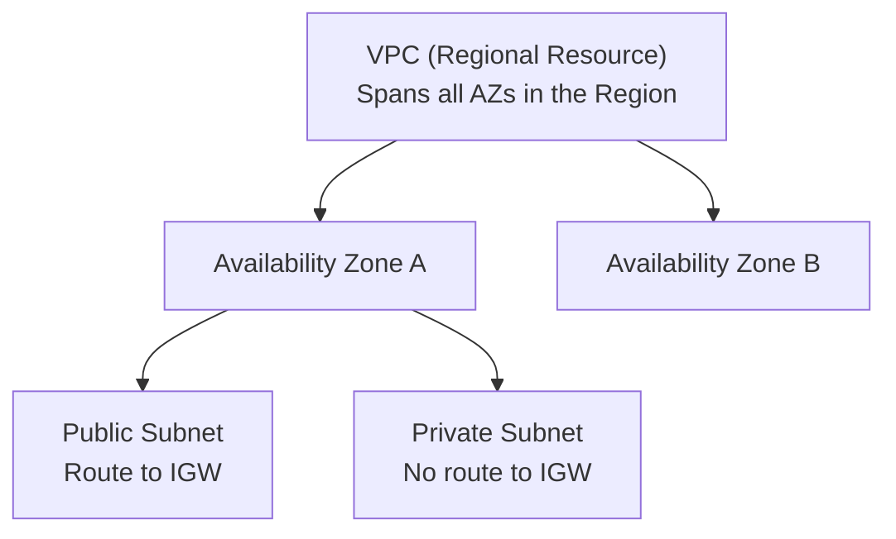
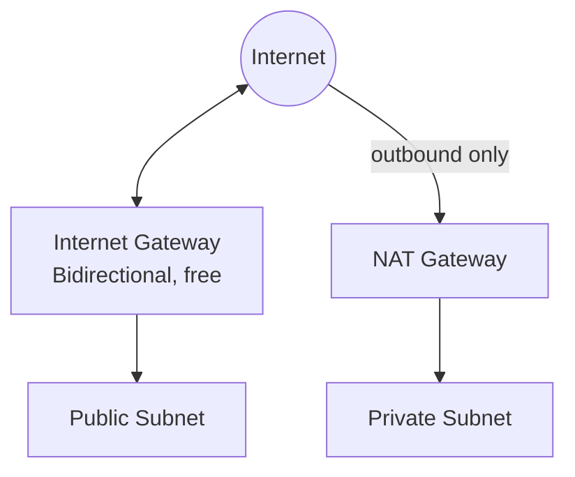
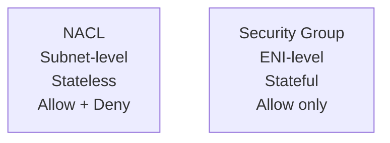
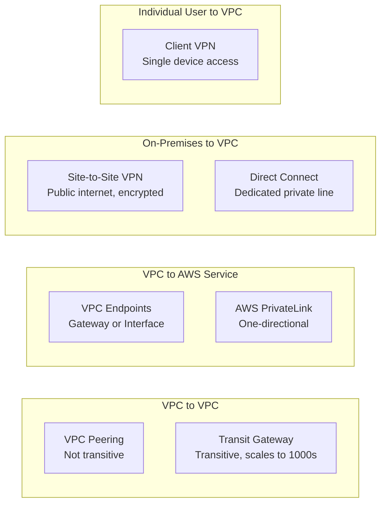

# Module 3: VPC & Networking — Complete Study Summary

---

## 1. VPC & Subnets — Introduction

> Core idea: **"Deny by default, allow what you configure."**

- **VPC** = logically isolated, private network, fully controlled by you
- **Regional resource** — spans all AZs in that Region
- **Default VPC**: exists in every account/Region — public subnet in every AZ, IGW attached, auto-assigned public IPs

### Subnets
- Slices of the VPC's IP range; each subnet = **AZ-level resource**
- **Public subnet** = route table sends `0.0.0.0/0` to an **Internet Gateway (IGW)**
- **Private subnet** = no direct route to IGW

> **⚠️ Exam anti-pattern:** A subnet is "public" ONLY because of its **route table** entry — NOT because of its CIDR range or its name.

- Every subnet has **one route table** controlling where traffic goes (internet, other subnet, VPN, or nowhere).

---

## 2. IP Addresses in AWS

| Type | Key Facts |
|---|---|
| **Public IPv4** | Reachable from internet; **changes on every stop/start** for auto-assigned IPs |
| **Private IPv4** | Routable only within private network; **stays same for instance lifetime** |
| **Elastic IP (EIP)** | Static, account-owned; attach/detach on demand; useful for DR failover |
| **IPv6** | ~340 undecillion addresses; **globally unique & public by design** (no "private IPv6"); **no additional charge** |

### ⚠️ Critical Exam Facts
- Need a **fixed** public IP → **Elastic IP** (not default auto-assigned)
- **Public IPv4 pricing**: **$0.005/hour (~$3.65/month)** for EVERY public IPv4 in use (EIP, EC2 auto-assigned, NAT Gateway, Load Balancer) — applies whether **active or idle**
- IPv6 has **no hourly charge**

---

## 3. Internet Gateway (IGW) & NAT Gateway

### Internet Gateway (IGW)
- Enables VPC ↔ internet communication
- **One IGW per VPC**, **free** (pay only for data transfer)
- Public subnet = route table sends `0.0.0.0/0` to IGW + resource needs **public IP**

### NAT Gateway vs. NAT Instance

| | **NAT Gateway** | **NAT Instance** |
|---|---|---|
| Management | AWS-managed | Self-managed on EC2 |
| Availability | HA within single AZ | Manual |
| Recommendation | **AWS default** — deploy 1 per AZ | Legacy option |

> **⚠️ Exam trap:** IGW = subnet gets internet access (in/out); **NAT Gateway = private subnet gets outbound-only internet access**

---

## 4. NACL vs. Security Groups — ⭐ Highest-Yield Comparison

| Feature | **NACL** | **Security Group** |
|---|---|---|
| Applies to | Entire **subnet** | **ENI** (EC2/RDS/Lambda) |
| Rule types | **ALLOW + DENY** | **ALLOW only** (implicit deny) |
| State | **Stateless** — must configure both directions | **Stateful** — return traffic auto-allowed |
| Rule evaluation | Ordered by rule number, first match wins | All rules combined (most permissive) |
| Rule targets | IP/CIDR + ports only | IP/CIDR + **other security groups** |
| Default | Default NACL: allow all; custom: deny all until rules added | Inbound blocked, outbound allowed by default |

> **⚠️ Exam tip:** Symptom = "return traffic blocked" → likely **NACL** (stateless) issue. Need explicit DENY of an IP → must use **NACL** (SGs can't deny).

---

## 5. VPC Connectivity Options — Full Overview

Ask yourself: **"What am I connecting, and does traffic cross the public internet?"**

### VPC Peering
- Connects **2 VPCs privately** over AWS's internal network
- **Requires non-overlapping CIDR blocks**
- Can connect: same/different accounts, same/different Regions

> **⚠️ NOT transitive:** A↔B, B↔C does NOT mean A↔C. Must create direct peering per pair.
> Scaling cost: N VPCs need up to **N×(N-1)/2 connections** — this is the problem **Transit Gateway** solves.

### VPC Endpoints

| Type | Used For | Mechanism | Cost |
|---|---|---|---|
| **Gateway Endpoint** | **S3 and DynamoDB ONLY** | Route table entry | **Free** |
| **Interface Endpoint** (via **AWS PrivateLink**) | Most other AWS services | Creates ENI with private IP | Hourly + data processing charge |

> **⚠️ Memorize word for word:** "S3 and DynamoDB use a Gateway Endpoint; everything else uses an Interface Endpoint"

### AWS PrivateLink
- Exposes your own service to thousands of VPCs (incl. other accounts)
- Requires **NLB** in provider's VPC; creates **ENI** in consumer's VPC
- **One-directional** (consumer reaches a specific service only)
- **Does NOT require non-overlapping CIDRs** (no full network merge)

### Site-to-Site VPN vs. Direct Connect

| | **Site-to-Site VPN** | **Direct Connect** |
|---|---|---|
| Path | Public internet (encrypted, IPsec) | Dedicated private line |
| Encryption | Automatic | **NOT encrypted by default** |
| Setup time | **Minutes** | **Weeks to months** (physical cross-connect) |
| Performance | Good, variable | Consistent, low latency, high throughput |
| Components | Customer Gateway (CGW) + Virtual Private Gateway (VGW) or Transit Gateway | Physical connection at DX location |

> **Best practice:** Combine **Direct Connect (primary)** + **Site-to-Site VPN (encrypted backup)**

### AWS Client VPN
- Connects a **single user's device** (not a whole network) to VPC + on-premises
- TLS-encrypted, travels over public internet

> **⚠️ Key distinction:**
> - **Site-to-Site VPN** = network-to-network (whole office ↔ AWS)
> - **Client VPN** = single user's device ↔ AWS

### Transit Gateway
- Provides **transitive routing** between thousands of VPCs and on-premises networks
- **Hub-and-spoke** architecture — attach each VPC **once**
- Supports up to **5,000 VPC attachments**
- Integrates with Direct Connect Gateway and Site-to-Site VPN

> **⚠️ Exam tip:**
> - "Connect many VPCs transitively, at scale" → **Transit Gateway**
> - "Connect just 2 VPCs" → **VPC Peering** (simpler, no hourly attachment charge)

---

## 6. Complete Connectivity Comparison Table

| Method | Connects | Traffic Path | Key Trait |
|---|---|---|---|
| **VPC Peering** | VPC ↔ VPC | AWS internal | Not transitive |
| **VPC Endpoints** | VPC ↔ AWS service | AWS internal | Gateway (S3/DDB, free) / Interface (PrivateLink, paid) |
| **AWS PrivateLink** | VPC ↔ specific service | AWS internal | One-directional |
| **Site-to-Site VPN** | On-premises ↔ VPC | Public internet (encrypted) | Fast setup |
| **Direct Connect** | On-premises ↔ VPC | Dedicated private line | Slow setup, best performance |
| **Client VPN** | Single user device ↔ VPC | Public internet (TLS) | Remote individual access |
| **Transit Gateway** | Many VPCs + on-premises (hub) | AWS internal | Transitive, scales to thousands |

---

## 7. VPC Flow Logs

> Answers: **"Who talked to whom, on what port, ACCEPT or REJECT?"**

⚠️ **Captures METADATA only — NOT packet contents/payload** (common exam trap)

### 3 Levels of Scope
| Level | Captures |
|---|---|
| **VPC** | Every ENI in the VPC |
| **Subnet** | Every ENI in that subnet |
| **ENI** | One specific interface |

### Use Cases
- Troubleshoot traffic not reaching an instance
- Diagnose overly restrictive Security Group/NACL rules
- Feed security/anomaly-detection tooling

**Also works for AWS-managed interfaces:** ELB, RDS, Aurora, ElastiCache (anywhere there's an ENI)

### Flow Log Destinations
| Destination | Use |
|---|---|
| **Amazon S3** | Long-term storage/analysis (e.g., Athena) |
| **CloudWatch Logs** | Real-time monitoring/alerting |
| **Kinesis Data Firehose** | Streaming to SIEM/analytics tools |

### ⚠️ Exam Anti-patterns
- **NOT real-time** — can take several minutes to appear
- Does NOT capture: packet payload, **DNS queries** (use Route 53 Resolver query logging instead), traffic to/from AWS-reserved addresses

---

## Quick Reference — Module 3 Exam Anchors

| If the question says... | Think... |
|---|---|
| "Subnet is public because named 'public-subnet'" | ⚠️ False — depends on route table only |
| "Public IP changes on stop/start" | Correct behavior — use Elastic IP for a fixed IP |
| "Private subnet needs outbound internet only" | NAT Gateway |
| "Return traffic blocked despite inbound allow" | NACL (stateless) |
| "Need to explicitly DENY an IP" | NACL (SGs can't deny) |
| "Connect VPC A to VPC C through B" | Not possible with Peering (not transitive) → Transit Gateway |
| "Access S3/DynamoDB privately, free" | Gateway Endpoint |
| "Access any other AWS service privately" | Interface Endpoint (PrivateLink) |
| "SaaS vendor exposes service to many customer VPCs" | AWS PrivateLink |
| "Need connectivity fast" | Site-to-Site VPN |
| "Need most consistent, highest-throughput private connection" | Direct Connect |
| "Remote employee needs secure access" | Client VPN |
| "Branch office needs permanent connection" | Site-to-Site VPN or Direct Connect |
| "Connect hundreds of VPCs transitively" | Transit Gateway |
| "Who talked to whom, ACCEPT/REJECT" | VPC Flow Logs |
| "Capture packet contents" | ⚠️ Not possible with Flow Logs |
