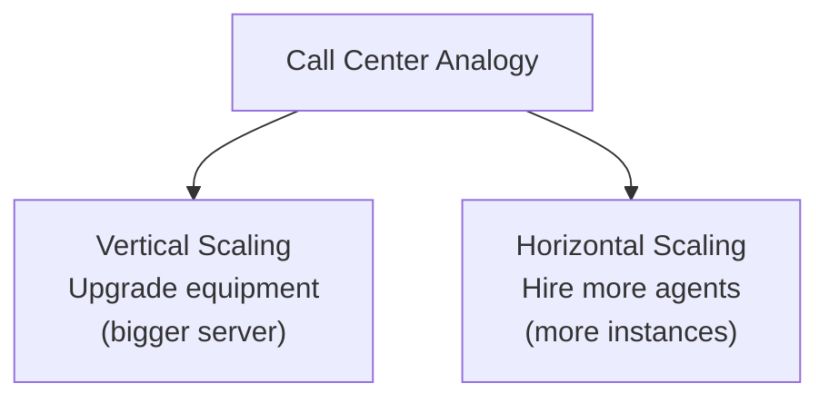
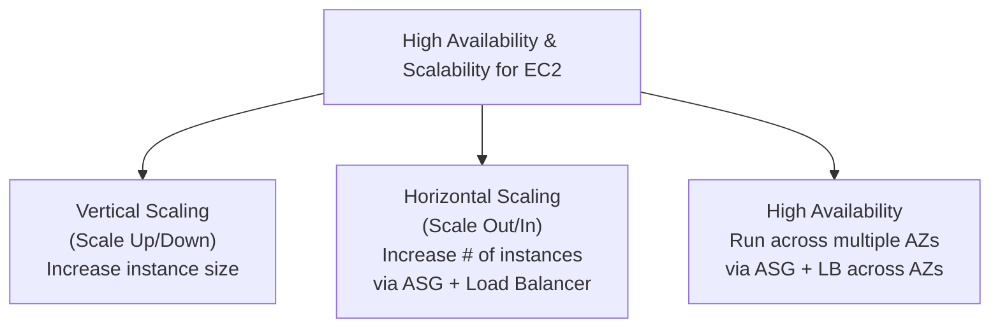
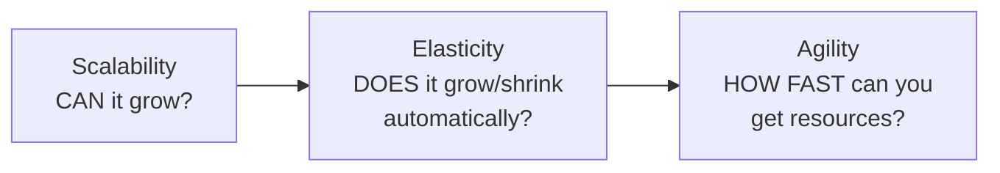
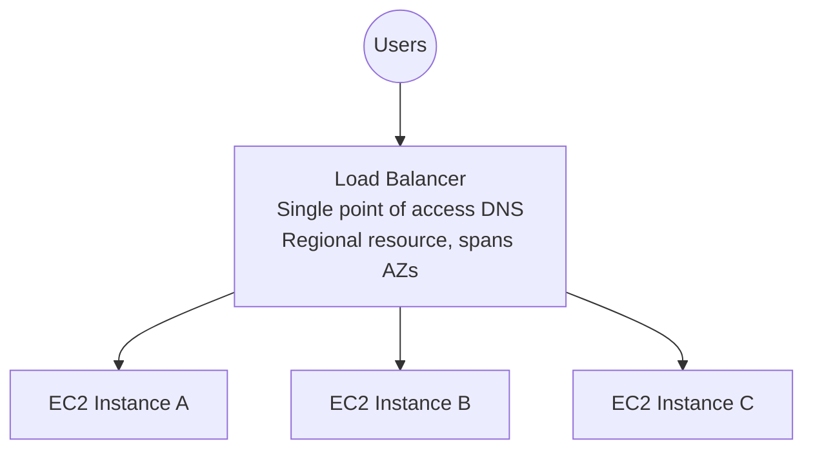
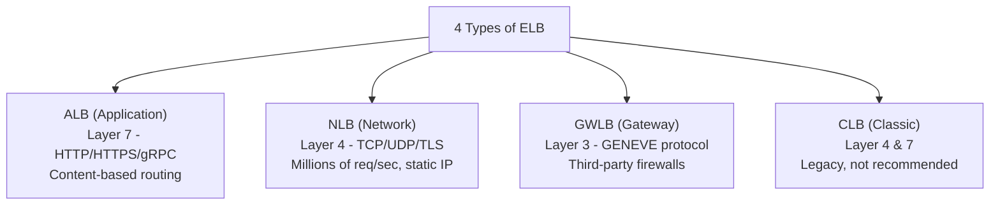
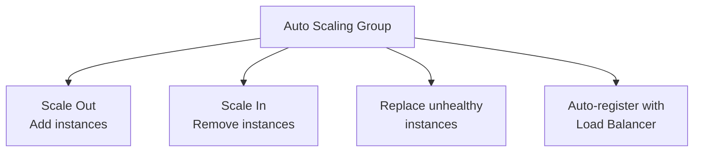
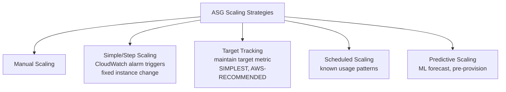
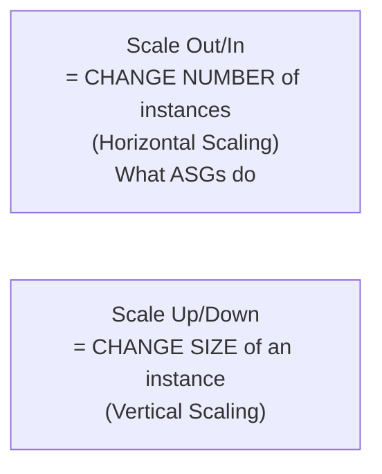

# Module 4: Scalability, High Availability & Load Balancing — Complete Study Summary

---

## 1. Scalability: An Introduction

- **Scalability** = ability of an application/system to handle increasing loads by adapting
- Two types: **Vertical** and **Horizontal (= Elasticity)**
- **Scalability ≠ High Availability** — a system can be scalable without being highly available, and vice versa

### Call Center Analogy

| Scenario in question | Concept |
|---|---|
| Distributing load across multiple resources | **Horizontal Scaling** |
| Upgrading to a bigger instance | **Vertical Scaling** |
| Surviving entire data center/AZ failure | **High Availability** |

---

## 2. Vertical Scalability

- Increasing the **size** of the instance (e.g., t2.micro → t2.large)
- Commonly used for **non-distributed systems** (e.g., databases)
- **Hard limit** exists (hardware ceiling)

> **⚠️ Exam anti-pattern:** Relying ONLY on vertical scaling for a production web app is a classic wrong answer:
> - Has a hard ceiling
> - Usually requires **downtime** to resize (stop → change type → start)
> - Does NOT provide High Availability on its own

---

## 3. High Availability

- Often accompanies **Horizontal Scaling** — ensures app runs in **at least 2 Availability Zones**
- Primary goal: maintain operation despite a data center loss or disaster

---

## 4. Scalability vs. Elasticity vs. Agility — ⭐ Critical Distinction

| Term | Meaning |
|---|---|
| **Scalability** | Ability to accommodate larger load — scale up (hardware) or scale out (nodes) |
| **Elasticity** | **Automatic** scaling based on load — pay-per-use, demand matching, cost optimization |
| **Agility** | **Unrelated to scalability** — how fast new IT resources can be provisioned (weeks → minutes) |

> **⚠️ Exam memorization:**
> - **Scalability** = can the system grow?
> - **Elasticity** = does it grow/shrink automatically with demand?
> - **Agility** = how fast can you get new resources in the first place?

---

## 5. Load Balancers — Introduction

**Benefits:**
- Distribute traffic across multiple instances
- Single point of access (**DNS**)
- Handle downstream instance failures seamlessly
- Regular **health checks**
- **SSL/TLS termination** (HTTPS) — offloads encryption from instances
- Ensures **high availability** across zones
- **Session stickiness** support (when needed)

> **⚠️ Exam tip:** ELB is a **regional resource**, spans multiple AZs — central to HA.
> **ELB itself does NOT scale instances** — that's the **Auto Scaling Group's** job. They're almost always used together, but solve different problems.

---

## 6. Types of Elastic Load Balancers (ELB)

| Type | Layer | Protocol | Best For |
|---|---|---|---|
| **ALB** | Layer 7 | HTTP/HTTPS/gRPC | Content-based routing (URL/host/headers), microservices, containers |
| **NLB** | Layer 4 | TCP/UDP/TLS | Ultra-high performance, millions of req/sec, static/Elastic IP per AZ |
| **GWLB** | Layer 3 | GENEVE (port 6081) | Deploy third-party firewalls/IDS/IPS transparently |
| **CLB** | Layer 4 & 7 | — | **Legacy** — supported but not recommended for new apps |

> **⚠️ Exam scenario cues:**
> - Path/host-based routing, microservices, containers → **ALB**
> - Extreme performance, static IP, TCP/UDP → **NLB**
> - Third-party firewalls/appliances → **Gateway Load Balancer**
> - CLB = legacy, **not shut down** — just not recommended

**Note:** Classic Load Balancer (product) ≠ "EC2-Classic" (networking, retired 2022–2023).

---

## 7. Auto Scaling Groups (ASG) — Introduction

**ASG goals:**
- Scale out (add instances) / Scale in (remove instances)
- Maintain min/max instance count
- Auto-register new instances with load balancer
- Replace unhealthy instances
- Optimize capacity/cost

**ASG is defined by:**
- **Launch Template** (AMI, instance type, key pair, security groups, etc.)
- **Min size**, **Max size**, optional **Desired capacity**

> **⚠️ Exam anti-pattern:** Launch Configuration is **legacy, immutable**, no mixed instance types/Spot support. Always use **Launch Template** for new ASGs.
> **⚠️ ASGs are free to use** — pay only for underlying resources (EC2, EBS, etc.)

---

## 8. ASG Scaling Strategies

| Strategy | How it Works |
|---|---|
| **Manual Scaling** | Adjust size manually |
| **Simple/Step Scaling** | Add/remove specific number when CloudWatch alarm triggers |
| **Target Tracking Scaling** | Auto-adjust to maintain a target metric — **simplest, AWS-recommended for most cases** |
| **Scheduled Scaling** | Plan scaling based on known time-based usage patterns |
| **Predictive Scaling** | Uses **ML** on historical CloudWatch data to forecast & pre-provision |

> **Predictive Scaling** works best combined with **Target Tracking**: predictive handles forecastable load, target tracking reacts to the unexpected.

### Warm Pools
- Pool of pre-initialized (stopped/running) instances **outside** ASG's active capacity
- ASG pulls from warm pool instead of booting from scratch → **dramatically cuts scale-out time**
- Useful for apps with **long boot/initialization times**

---

## 9. Critical Terminology — Scale Out/In vs. Scale Up/Down

> **⚠️ Exam is precise about this terminology.**
> Also remember: an ASG's default **health check grace period** matters — if too short, a slow-booting instance can be marked unhealthy and terminated before it finishes starting up.

---

## Quick Reference — Module 4 Exam Anchors

| If the question says... | Think... |
|---|---|
| "Distributing load across multiple resources" | Horizontal Scaling |
| "Upgrading to a bigger instance" | Vertical Scaling |
| "Surviving an entire AZ failure" | High Availability |
| "Automatic scaling based on demand" | Elasticity |
| "How fast can you get new resources" | Agility |
| "Single point of access, distributes traffic" | Load Balancer |
| "Load Balancer scales the instances" | ⚠️ False — that's the ASG's job |
| "Content-based routing / microservices" | Application Load Balancer (ALB) |
| "Millions of requests/sec, static IP, TCP/UDP" | Network Load Balancer (NLB) |
| "Deploy third-party firewalls transparently" | Gateway Load Balancer (GWLB) |
| "Launch Configuration vs. Launch Template" | Always use Template — Configuration is legacy |
| "Simplest, AWS-recommended scaling strategy" | Target Tracking Scaling |
| "Forecast recurring traffic spikes with ML" | Predictive Scaling |
| "Cut scale-out time using pre-initialized instances" | Warm Pools |
| "Instance marked unhealthy before finishing boot" | Health check grace period too short |
