# Module 5: Amazon S3 & Data Migration — Complete Study Summary

---

## 1. Introduction to Amazon S3

- **S3 (Simple Storage Service)** = highly scalable, durable, secure **object storage**
- Stores any amount of data — single file to exabytes, millions of objects ("infinitely scaling")

**Object size limits:**
- Each object: **0 bytes to 5 TB**
- Single **PUT upload**: capped at **5 GB** — larger requires **multipart upload**

**Key features:** Versioning, lifecycle policies, fine-grained access control, S3 Transfer Acceleration
**Native integration:** Athena, CloudFront, Lambda, Glue

**Common use cases:** Backup/recovery, data archiving, static website hosting, content distribution, data lake

> **⚠️ Exam tip:** "Store files/objects" (no file system/database mentioned) → almost always **S3**. One of the most heavily tested services.

---

## 2. Objects & Buckets in S3

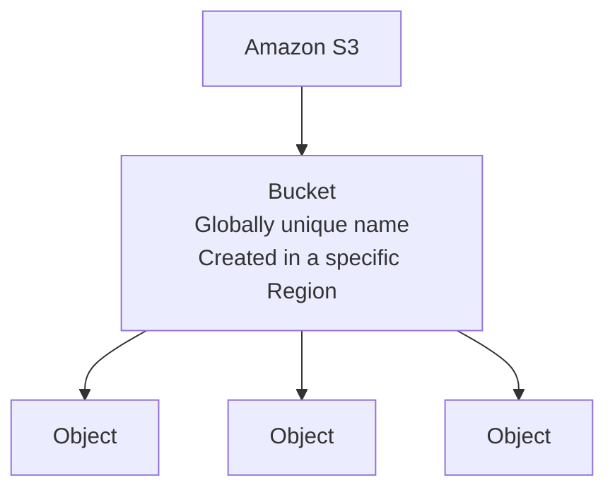

- **Bucket names must be globally unique** across ALL regions and accounts (once taken, no one else can use it — even different account)
- Buckets created in a **specific Region**; objects physically live there unless **replication** set up
- S3 appears global (DNS namespace is shared worldwide), but **buckets are region-confined** (data physically lives in one Region)

### Naming Conventions
- No uppercase letters or underscores
- Length: **3–63 characters**
- Not in the format of an IP address
- Must start with lowercase letter or number
- Cannot start with `xn--` or end with `-s3alias`/`--ol-s3`

> **Memory hook:** Bucket name must look like a valid **domain name** — lowercase, no underscores, 3–63 chars.

---

## 3. Bucket Policies

- **Resource-based policy** in JSON, attached to the **bucket** (vs. IAM policy → attached to user/role)

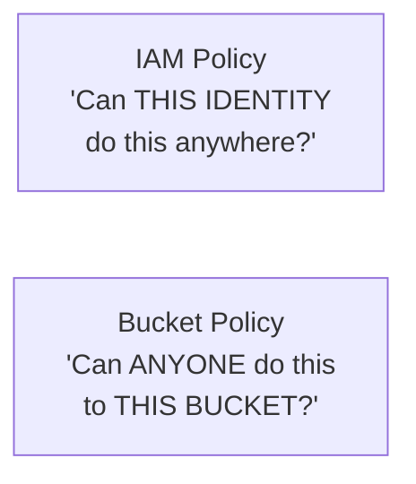

**Use cases:** Enable public access (static website), mandate encryption, cross-account access, force HTTPS-only (`aws:SecureTransport`)

> **⚠️ Exam anti-pattern:** Making an entire bucket public to share a few files.
> - **S3 Block Public Access** = enabled by default on all new buckets
> - Safer pattern: keep bucket **private** + use **presigned URLs** for temporary access

---

## 4. Durability vs. Availability — ⭐ Critical Distinction

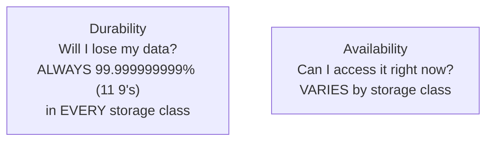

- S3 designed for **99.999999999% (11 9's)** durability — data redundant across **minimum 3 AZs**
- 10M objects → expect to lose 1 object every **10,000 years**
- **11 9's applies to ALL storage classes** — durability never changes, only availability/retrieval speed

| Storage Class | Availability |
|---|---|
| **S3 Standard** | 99.99% (~53 min downtime/year) |
| **Standard-IA / Glacier tiers** | 99.9% |
| **One Zone-IA** | 99.5% |

> **⚠️ Watch out:** "One Zone" classes store data in **only 1 AZ** — if destroyed, data is gone. Only use for easily recreatable/replication-target data.

---

## 5. Static Website Hosting

- S3 can host static websites — **no web server required**
- Endpoint format: `bucket-name.s3-website-[region].amazonaws.com`

> **⚠️ Key limitation:** S3 website endpoint supports **HTTP only, NOT HTTPS**
> - For HTTPS + custom domain → **CloudFront** in front, or **AWS Amplify Hosting**

**⚠️ Exam tip:** Publicly reachable website needs **BOTH**:
1. Static website hosting enabled
2. Bucket policy (or adjusted Block Public Access) allowing public reads

---

## 6. Versioning in S3

- Must be enabled at the **bucket level**
- Overwriting same key → increments version (1, 2, 3...)

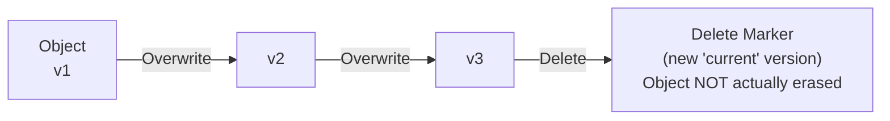

- Objects existing **before** versioning enabled → version ID **"null"**
- **Suspending** versioning: doesn't delete existing versions, only stops creating new ones
- **Deleting** a versioned object: adds a **delete marker**, doesn't erase it — must delete the specific version ID to permanently remove
- **MFA Delete**: requires multi-factor auth before permanently deleting a version

> **⚠️ Classic exam trick:** Once enabled, versioning **cannot be fully disabled** — only **suspended**.

---

## 7. Replication (CRR & SRR)

- **Versioning required** on BOTH source and destination buckets

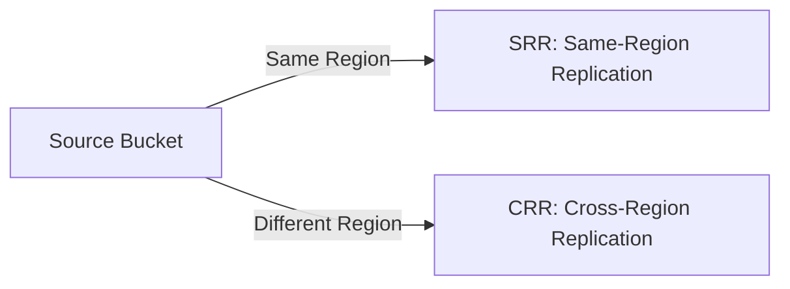

| Type | Use Case |
|---|---|
| **SRR** | Log aggregation across accounts, compliance requiring same-Region copies |
| **CRR** | Lower-latency global access, disaster recovery |

**Key facts:**
- Buckets can be in **different AWS accounts**
- Copying is **asynchronous**
- **NOT retroactive** — only new uploads replicate (use **S3 Batch Replication** to backfill)
- **Delete markers NOT replicated by default**
- **Deleting a specific version ID is NEVER replicated**

---

## 8. S3 Storage Classes — Full Reference

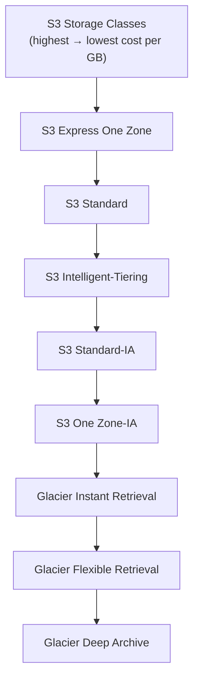

| Class | Best For | Retrieval | AZs |
|---|---|---|---|
| **S3 Standard** | Frequently accessed | Instant | Multi-AZ, 99.99% avail |
| **S3 Express One Zone** | Latency-sensitive (ML training, real-time) | Single-digit ms, up to 10x faster | Single AZ, directory bucket |
| **S3 Standard-IA** | Accessed < once/month, needed instantly | Instant | Multi-AZ |
| **S3 One Zone-IA** | Same as Standard-IA, 20% cheaper | Instant | Single AZ — replaceable data only |
| **Glacier Instant Retrieval** | Archive, ~once/quarter | Milliseconds | Multi-AZ |
| **Glacier Flexible Retrieval** | Archive, 1-2x/year, free bulk retrieval | Minutes-hours | Multi-AZ |
| **Glacier Deep Archive** | **Cheapest**, 7-10+ yr compliance retention | Hours | Multi-AZ |
| **S3 Intelligent-Tiering** | **Unknown/changing access patterns** | Auto-moves tiers, no retrieval fees | Multi-AZ |

> **⚠️ Exam tip:** "Unknown or changing access patterns" = signature phrase for **Intelligent-Tiering**.

### Storage Class Quick Decision Map
| Scenario | Class |
|---|---|
| Frequently accessed | Standard |
| Unknown/changing pattern | Intelligent-Tiering |
| Infrequent, needs fast access | Standard-IA (or One Zone-IA if replaceable) |
| Archive, needs immediate access | Glacier Instant Retrieval |
| True cold archive | Glacier Flexible / Deep Archive |

---

## 9. S3 Encryption

- **All new objects encrypted by default** using **SSE-S3**, no extra cost (since January 2023)

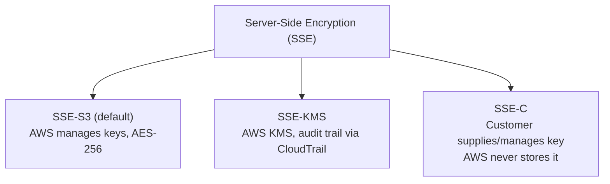

| Type | Key Management | Key Feature |
|---|---|---|
| **SSE-S3** (default) | AWS manages fully | AES-256, free |
| **SSE-KMS** | AWS KMS | **Audit trails via CloudTrail**, finer key-usage control |
| **SSE-C** | Customer | AWS never stores the key |

> **⚠️ Exam tip:** "Need audit trail of who used the encryption key" → **SSE-KMS**
> "Encryption in transit" is separate from encryption at rest — that's just enforcing HTTPS.

---

## 10. IAM Access Analyzer for S3

- **Detective control** in S3 console — continuously checks buckets, flags unexpected external access
- Evaluates: S3 Bucket Policies, ACLs, Access Point Policies together
- Flags: buckets open to public internet, shared outside your organization
- **Does NOT block access** — only alerts

> **⚠️ Exam tip — critical distinction:**
> - **IAM Access Analyzer for S3** = **detective control** (finds & reports)
> - **S3 Block Public Access** = **preventive control** (stops it happening)

---

## 11. Shared Responsibility Model: S3

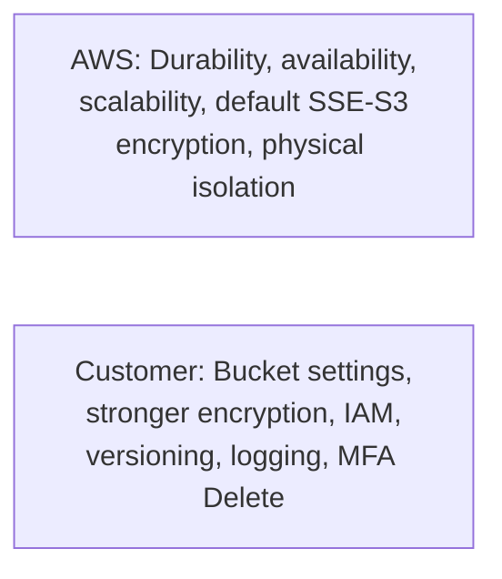

**⚠️ Misconfigured public buckets = customer responsibility, NOT an AWS failure.**

---

## 12. Data Migration — The Snow Family

### Why Offline Migration?
Challenges moving large data over network: limited connectivity/bandwidth, high network cost, shared bandwidth, connection stability.

> **⚠️ Major update:** Since **Nov 7, 2025**, AWS closed **Snow Family (Snowball Edge)** to new customers. Existing customers continue; new customers use **AWS DataSync** (online) or **AWS Data Transfer Terminal** (physical, in-person).

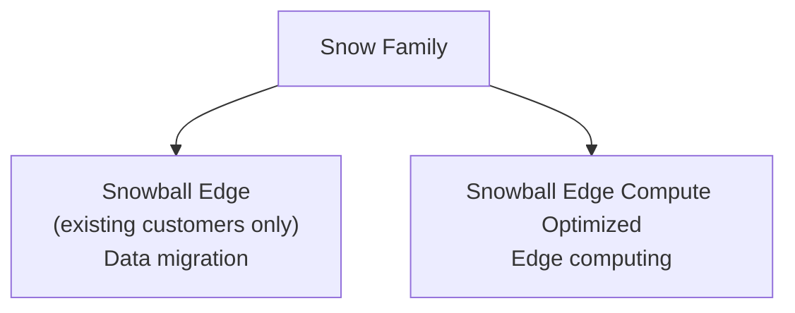

### Snowball Edge (for data transfers)
- Moves **TBs to PBs** of data in/out of AWS
- Pay-per-transfer-job pricing
- Provides block storage + S3-compatible object storage

**Current generation models:**
| Model | Specs | Best For |
|---|---|---|
| **Storage Optimized** | 210 TB, NVMe | Bulk data transfer |
| **Compute Optimized** | 104 vCPUs, 416 GiB RAM, optional GPU, 28 TB NVMe | Edge compute, ML workloads |

**Usage process:** Request device → Install software (Snowball client / AWS OpsHub) → Connect and copy → Return device → Data transfer to S3 → Device wiped

### AWS OpsHub
- **GUI tool** (replaced the need for CLI) for managing Snow Family devices
- Enables: unlock/configure devices, transfer files, launch/manage instances, monitor metrics

### Edge Computing with Snowball Edge
- For processing data at edge locations (moving truck, ship, mining station) with limited/no connectivity
- Use cases: preprocessing data before cloud, running ML models at edge, transcoding media on-site
- All models can run **EC2 instances & Lambda functions** (via AWS IoT Greengrass)

### AWS Data Transfer Terminal (New Alternative)
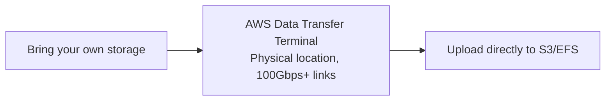
- **Physical location** (not a shipped device) — bring your own storage, plug in directly
- Each site: at least **two 100 Gbps fiber links**
- No shipping delays — upload on the spot, leave with your equipment
- Currently for **AWS Enterprise Support** customers

| vs. | Key Difference |
|---|---|
| **Snowball Edge** | No waiting for device ship/fill/return |
| **Direct Connect** | One-time bulk upload visit, not a persistent link |
| **Online transfer (DataSync)** | For when local bandwidth can't move data fast enough |

---

## 13. Hybrid Cloud for Storage — AWS Storage Gateway

**Problem:** S3 is proprietary storage tech (unlike EFS/NFS) — how do you expose S3 data on-premises **continuously**?

> **⚠️ Key distinction:**
> - **Snow Family** = **one-time bulk transfer**
> - **Storage Gateway** = **ongoing, continuous access** to cloud storage from on-premises apps

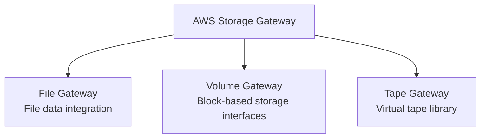

**Use cases:** Disaster recovery (replicate to cloud), backup & restore, tiered storage (move cold data to cloud)

| Type | Purpose |
|---|---|
| **File Gateway** | Integrates on-premises with cloud storage for **file data** |
| **Volume Gateway** | **Block-based** storage interfaces |
| **Tape Gateway** | Simulates physical **tape library** with virtual tape in AWS |

---

## Quick Reference — Module 5 Exam Anchors

| If the question says... | Think... |
|---|---|
| "Store files/objects, no DB/filesystem mentioned" | S3 |
| "Bucket name already taken by another account" | S3 buckets are globally unique |
| "Will I lose my data?" | Durability (always 11 9's) |
| "Can I access it right now?" | Availability (varies by class) |
| "Data in only 1 AZ, risk of loss" | One Zone classes |
| "S3 website needs HTTPS" | Put CloudFront in front |
| "Disable versioning" | Not possible — only suspend |
| "Log aggregation, same Region, compliance" | SRR |
| "Lower latency global access, DR" | CRR |
| "Unknown/changing access patterns" | Intelligent-Tiering |
| "Audit trail for encryption key usage" | SSE-KMS |
| "Detect unexpected public bucket access" | IAM Access Analyzer for S3 |
| "Prevent public access from the start" | S3 Block Public Access |
| "One-time bulk data transfer, no internet" | Snowball Edge |
| "Continuous access to S3 from on-premises app" | AWS Storage Gateway |
| "Bring own storage, upload on the spot" | AWS Data Transfer Terminal |
