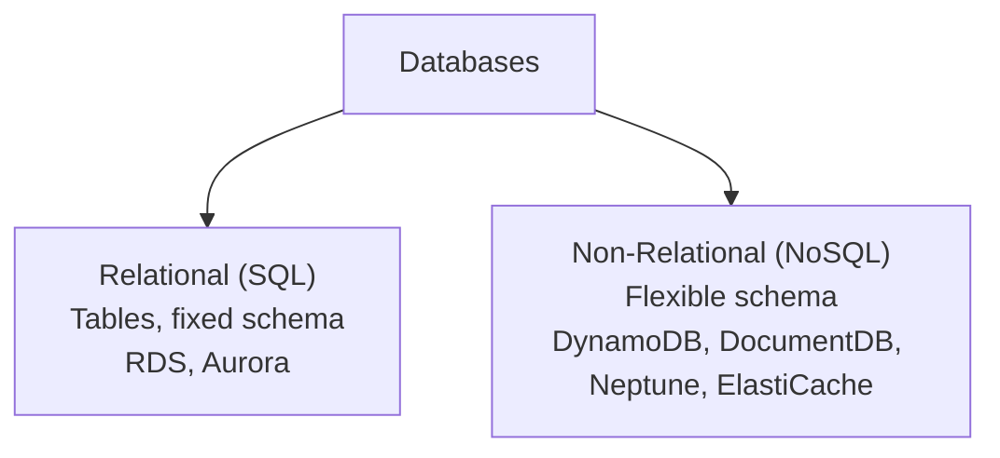
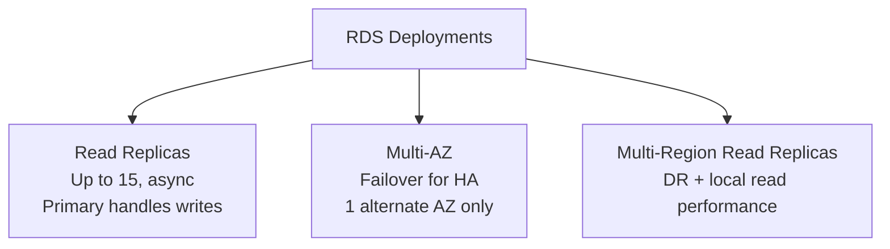
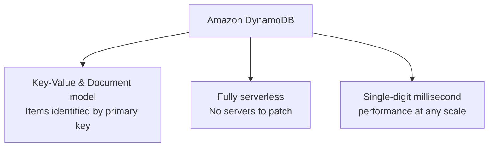
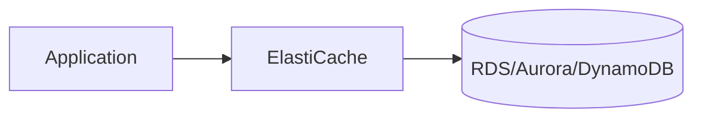
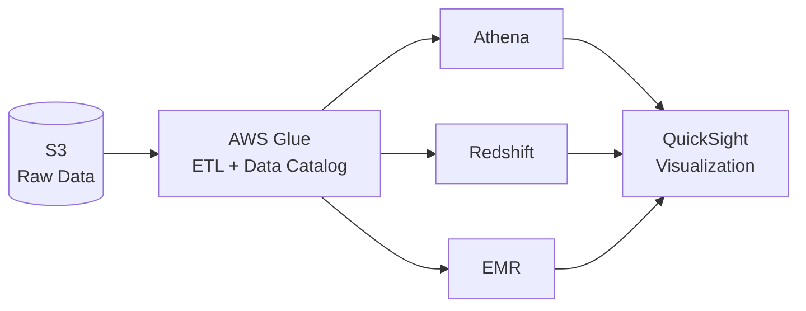
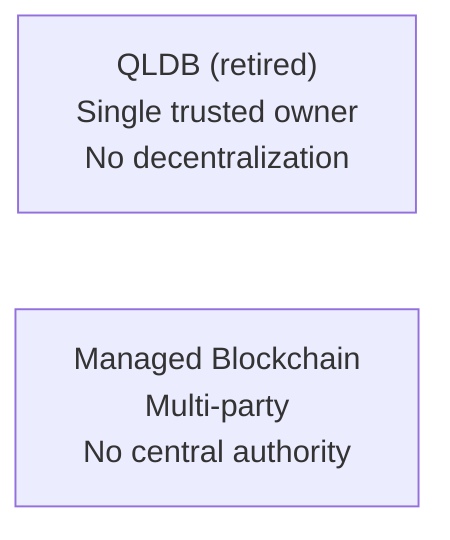
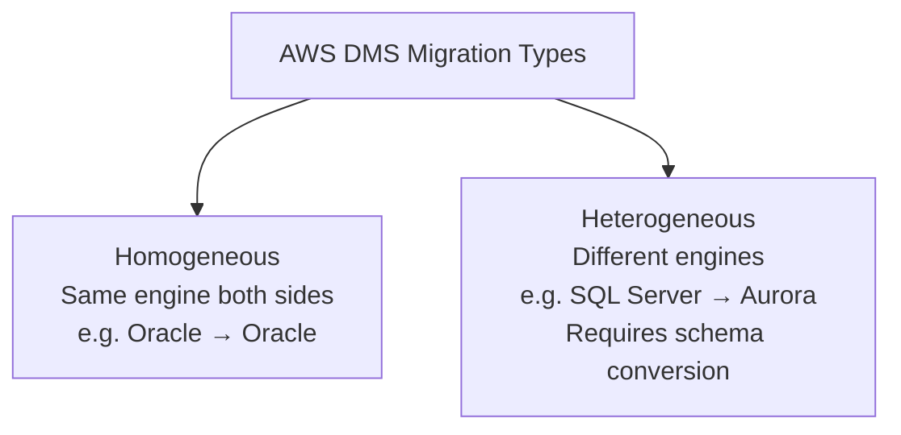
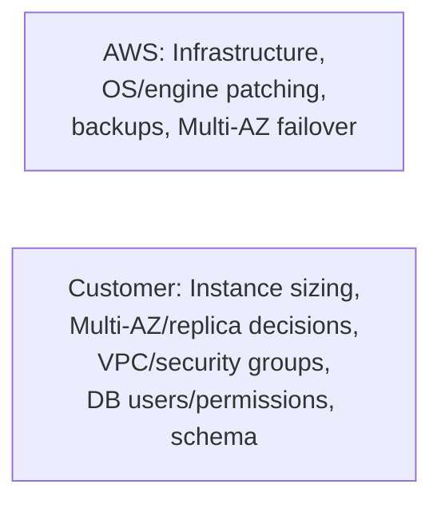
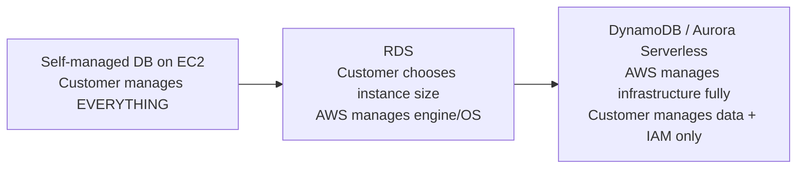

# Module 6: Databases & Analytics — Complete Study Summary

---

## 1. Why Do We Need Databases?

Storing data (in files, e.g., S3/EBS) is not the same as being able to **use** it efficiently. Databases provide:
- **Structure** — consistent way to organize related data
- **Indexes** — search millions of records in milliseconds
- **Relationships** — connect datasets together (e.g., customer ↔ orders)

**No single "best" database** — AWS offers many purpose-built services.

CLF-C02 splits databases into **2 big buckets**: **Relational** and **Non-relational (NoSQL)**

> **⚠️ Exam pattern:**
> - "Shopping cart, unpredictable traffic spikes" → DynamoDB
> - "Complex SQL joins, financial reporting" → RDS/Aurora

---

## 2. Relational vs. Non-Relational Databases

| | **Relational (SQL)** | **Non-Relational (NoSQL)** |
|---|---|---|
| Structure | Tables (rows/columns) | Flexible (key-value, document, graph, wide-column) |
| Schema | Fixed, defined upfront | Dynamic/schema-less |
| Relationships | Foreign keys, complex joins | Not enforced; simple lookups |
| Query language | SQL | Varies by type |
| Best for | **OLTP** — banking, orders, inventory | Massive scale, low latency — gaming, IoT, mobile |
| AWS examples | RDS, Aurora | DynamoDB, DocumentDB, Neptune, ElastiCache |

> **⚠️ Anti-pattern:**
> - Choosing **RDS** for massive horizontal scale + unpredictable traffic → should be DynamoDB
> - Choosing **DynamoDB** for complex multi-table joins → should be RDS/Aurora

---

## 3. Amazon RDS

- **Managed service** for relational (SQL) databases — AWS handles undifferentiated heavy lifting
- **6 supported engines:** PostgreSQL, MySQL, MariaDB, Oracle, SQL Server, Db2

> **⚠️ Aurora is NOT an RDS engine** — separate AWS-built service with its own console entry

### RDS Deployments

| Deployment | Key Facts |
|---|---|
| **Read Replicas** | Up to 15, async replication, primary handles writes |
| **Multi-AZ** | Failover for HA, limited to 1 alternate AZ |
| **Multi-Region** | Disaster recovery, local performance for global reads |

### RDS Advantages over Self-Managed EC2 Database
- Automated provisioning & OS/engine patching
- Continuous automated backups with point-in-time restore
- Built-in monitoring (CloudWatch)
- Read replicas, Multi-AZ for HA/DR
- Storage backed by EBS

**Trade-off:** No OS-level (SSH) access — managed via RDS API/console only.

> **⚠️ Exam tip:** "Less management overhead" → RDS; "needs OS-level access or unsupported engine" → EC2 self-hosted

---

## 4. Amazon Aurora

- AWS's own **cloud-native** relational database, compatible with **MySQL** and **PostgreSQL**
- Performance (AWS marketing figures): up to **5x MySQL**, up to **3x PostgreSQL** throughput vs. RDS
- Storage auto-scales in 10 GB increments, up to **256 TiB** per cluster
- Typically **higher pricing** than equivalent RDS instances

### Aurora Serverless
- Auto-scales dynamically based on demand
- **Pay-per-second billing** (Aurora Capacity Units — ACUs)
- Ideal for: irregular/sporadic/unpredictable workloads (dev/test, infrequent bursts)

> **⭐ Update (2026):** Aurora PostgreSQL Serverless now on **AWS Free Tier** ($100 credits)

---

## 5. NoSQL Databases & JSON

- **NoSQL** = non-relational databases with flexible schemas for modern applications
- **Advantages:** Flexibility, horizontal scalability, high performance, tailored functionality
- **JSON** fits naturally into NoSQL due to its schema-less, nestable nature

---

## 6. Amazon DynamoDB

- Fully managed, **serverless** NoSQL **key-value & document** database
- Single-digit-millisecond performance at any scale
- **On-Demand** capacity (auto-scales) or **Provisioned** capacity + Auto Scaling
- Pay only for read/write requests + storage used

**Ideal for:** shopping carts, gaming leaderboards, session state, IoT device data

### DynamoDB Global Tables
- Makes a table accessible with low latency across multiple Regions
- **Active-Active replication** — read/write to ANY AWS Region (unlike RDS Multi-Region, where only primary writes)

---

## 7. Amazon DocumentDB

- Fully managed **document database**, **MongoDB-compatible** (same drivers/tools)
- Shares deployment concepts with Aurora (cluster architecture, storage scales independently)
- Data replicated across **3 AZs**
- Storage auto-grows in **10 GB increments**

> **⚠️ Exam distinction:**
> - **DocumentDB** = document model, MongoDB-compatible
> - **DynamoDB** = key-value model
> - Scenario mentions "MongoDB" → DocumentDB; general "NoSQL at scale" → usually DynamoDB

---

## 8. Amazon ElastiCache

- Managed service for **in-memory caches**, supports **Redis** and **Memcached**
- Stores frequently accessed data in memory → **microsecond-level** read latency
- Placed **in front of a database** — absorbs repetitive read traffic

---

## 9. DynamoDB Accelerator (DAX)

- **Fully managed in-memory cache built specifically for DynamoDB**
- Up to **10x performance improvement** — reads drop to microseconds
- Fully compatible with existing DynamoDB API calls

| | **DAX** | **ElastiCache** |
|---|---|---|
| Scope | Purpose-built exclusively for **DynamoDB** | **General-purpose** cache for any database |
| Engine | DAX-specific | Redis / Memcached |

> **Exam rule:** "Cache in front of DynamoDB specifically" → DAX; "General-purpose cache" → ElastiCache

---

## 10. Amazon Redshift

- AWS's **data warehouse** service — engine based on PostgreSQL, but **NOT for OLTP**
- Purpose-built for **OLAP** (Online Analytical Processing)
- Typical pattern: data loaded in **batches**, then heavily queried for reporting

**Key technical features:**
- **Columnar storage** (vs. row-based) — fast for analytical queries touching few columns
- **Massively Parallel Processing (MPP)**
- Supports Multi-AZ deployments

**Integrates with BI tools:** Amazon QuickSight, Tableau

### Redshift Serverless
- Auto-provisions/scales capacity, pay-only-for-what-you-use
- Use cases: reporting, dashboarding, real-time analytics

> **⚠️ OLTP vs. OLAP:**
> - **OLTP** → RDS/Aurora (transactions, row-based, many small fast operations)
> - **OLAP** → Redshift (analytics, columnar, few large complex queries)

---

## 11. Amazon EMR (Elastic MapReduce)

- Managed **big data platform**, processes massive datasets using **clusters of EC2 instances**
- Supports open-source frameworks: **Hadoop, Spark, HBase, Flink, Hive, Presto/Trino**
- Common uses: large-scale **ETL**, data processing, ML data preparation
- Cost-saving via **Spot Instances** for non-critical processing nodes

> **⚠️ Exam distinction (EMR vs. Redshift):**
> - **Redshift** = data warehouse, SQL analytics, structured data
> - **EMR** = big data frameworks (Hadoop/Spark), ETL, structured + unstructured data

---

## 12. Amazon Athena

- **Serverless query service** — run **SQL directly against data in S3**, no database loading required
- Built on **Presto/Trino**; supports CSV, JSON, ORC, Avro, **Parquet**
- **Pricing:** $5.00 per TB of data **scanned**

> **⚠️ Cost optimization:** Use compressed **columnar formats** (Parquet) + **partitioning** → can cut costs by up to 90%

**Common use cases:** Ad hoc BI, analyzing S3-based logs (VPC Flow Logs, CloudTrail) without infrastructure

---

## 13. Amazon QuickSight

- Serverless, **ML-powered BI service** for interactive dashboards/visualizations
- Per-session pricing for occasional users
- **ML-powered insights**: anomaly detection, forecasting
- Connects to: RDS, Aurora, Athena, Redshift, S3, third-party sources

### The Full Analytics Pipeline

---

## 14. Amazon Neptune

- Fully managed **graph database** — for data where relationships matter as much as items
- Classic example: social network (users = nodes, friendships = edges)
- Highly available across **3 AZs**, up to **15 read replicas**
- Optimized for **traversing highly connected data** — "friends of friends" queries are fast here, painfully slow as SQL joins

**Use cases:** knowledge graphs, **fraud detection**, recommendation engines, social networking

---

## 15. Amazon Timestream

- Fully managed, **serverless time series database**
- For **time-stamped data**: sensor readings, application metrics, industrial telemetry
- Handles **trillions of events per day**
- Faster/cheaper than relational DB thanks to **automatic data tiering** (recent = fast storage, old = cheap storage)
- Built-in analytics: smoothing, interpolation, approximation

---

## 16. Amazon QLDB — ⚠️ RETIRED

- **Discontinued July 31, 2025** — migration path: **Amazon Aurora PostgreSQL**
- Was: transparent, immutable, cryptographically verifiable ledger log
- **Difference from Managed Blockchain:** QLDB had **no decentralization** — single trusted owner

---

## 17. Amazon Managed Blockchain

- Multiple parties execute/record transactions **without a central authority**
- Options: join public blockchain networks OR create private network
- Supports **Hyperledger Fabric**

---

## 18. AWS Glue

- Fully managed, **serverless ETL** service
- Discovers, prepares, combines data from multiple sources for analytics tools (Athena, Redshift, QuickSight)
- **AWS Glue Data Catalog** = central metadata repository — both **Athena** and **Redshift Spectrum** rely on it to know what data exists in S3 and its structure

---

## 19. AWS DMS (Database Migration Service)

- Moves data from source database into AWS quickly/securely
- **Key selling point:** source database stays **fully operational** throughout migration

- Supports ongoing **replication / Change Data Capture (CDC)** until ready to cut over

### Schema Conversion Tools
| Tool | Type | Best For |
|---|---|---|
| **AWS DMS Schema Conversion (DMS SC)** | Web-based, built into DMS console | **AWS's current recommended path** |
| **AWS Schema Conversion Tool (AWS SCT)** | Standalone desktop app | Large data warehouse migrations (e.g., to Redshift) |

---

## 20. RDS Shared Responsibility Model

> **⚠️ Classic question:** "Who patches the RDS operating system?" → **AWS** (unlike self-managed DB on EC2, where it's entirely the customer's job)

---

## 21. How the Line Shifts with More "Serverless" Services

| | **RDS** | **DynamoDB (serverless)** |
|---|---|---|
| Instance sizing | Customer chooses | AWS handles automatically |
| Scaling | Customer manages | Automatic |
| Customer's main job | Infrastructure sizing + data | **Data + IAM access control only** |

> **⚠️ Exam tip:** "Least operational overhead" → serverless option (DynamoDB, Aurora Serverless) beats standard RDS.

---

## Quick Reference — Module 6 Exam Anchors

| If the question says... | Think... |
|---|---|
| "Shopping cart, unpredictable traffic" | DynamoDB |
| "Complex SQL joins, financial reporting" | RDS/Aurora |
| "MongoDB-compatible" | DocumentDB |
| "Microsecond cache in front of any DB" | ElastiCache |
| "Microsecond cache specifically for DynamoDB" | DAX |
| "Data warehouse, SQL analytics, BI" | Redshift |
| "Hadoop/Spark/Hive big data processing" | EMR |
| "SQL directly on S3, no database" | Athena |
| "Dashboards and visualizations" | QuickSight |
| "Social network, fraud detection via connections" | Neptune |
| "IoT sensor data over time" | Timestream |
| "Immutable ledger" (historical) | QLDB (retired) → Aurora PostgreSQL |
| "Multi-party, no central authority" | Managed Blockchain |
| "Prepare/catalog data for Athena" | AWS Glue |
| "Migrate DB with minimal downtime" | AWS DMS |
| "Who patches RDS OS?" | AWS |
| "Least operational overhead database" | DynamoDB / Aurora Serverless |
