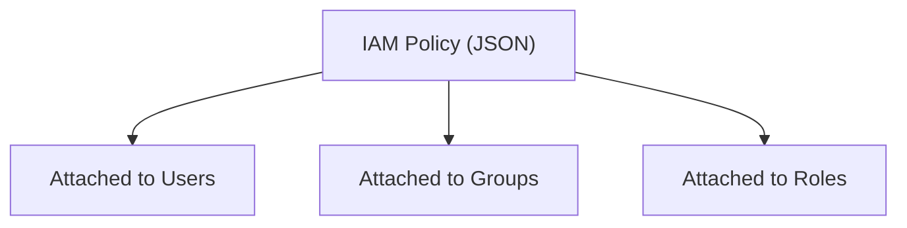
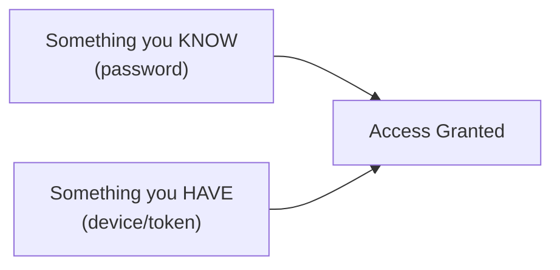
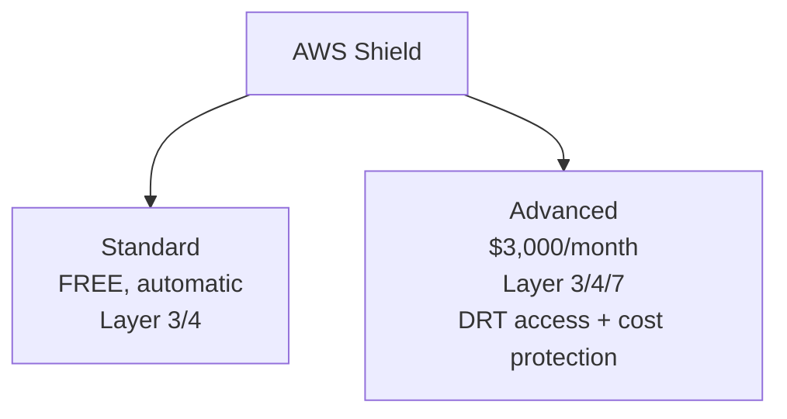
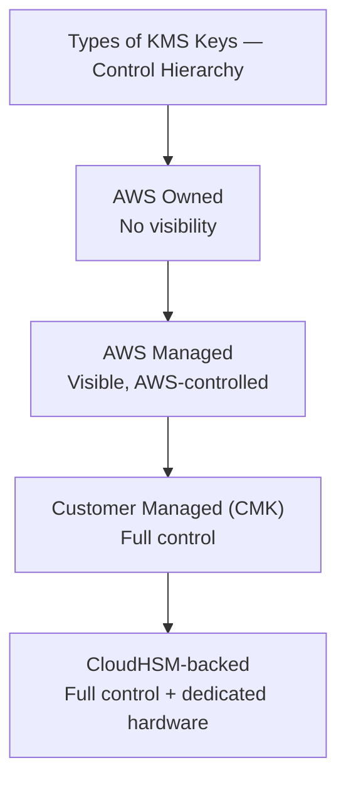
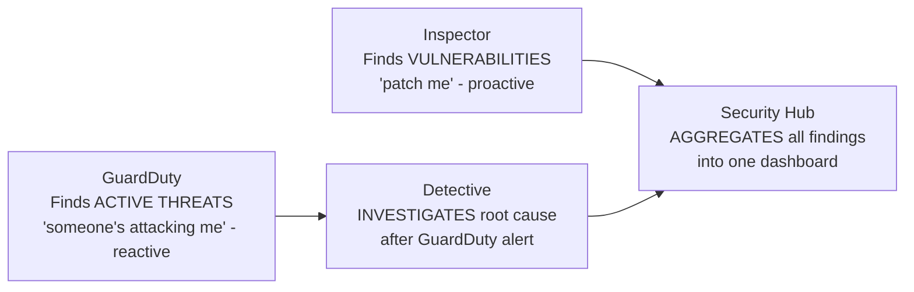

# Module 7: IAM & Security Services — Complete Study Summary

---

# PART A: Identity & Access Management (IAM)

## 1. IAM Basics

- IAM controls **who/what** can access AWS resources and **what they're allowed to do**
- **Global service** — configured once, applies across ALL Regions

### Root User
- Created automatically at account sign-up
- **Unrestricted access to everything**, including billing

> **⚠️ Anti-pattern:** Using root for routine daily tasks. Root should be used **only for a handful of account-level tasks**.

---

## 2. Permissions & Policies

- **Policies** = JSON documents defining permissions, attached to Users, Groups, or Roles
- **Least Privilege Principle**: grant ONLY the permissions needed
  - Example: developer needing to read from S3 → grant `s3:GetObject` only, NOT `s3:*`

### Policy Structure
| Element | Required? | Description |
|---|---|---|
| **Version** | Yes (always "2012-10-17") | Policy language version |
| **Statement** | **Required** | One or more statements |
| **Effect** | **Required** | Allow or Deny |
| **Principal** | Context-dependent | Account/user/role the policy applies to |
| **Action** | **Required** | Allowed/denied actions |
| **Resource** | **Required** | Resources the actions apply to |
| **Condition** | Optional | Criteria for when policy applies |

---

## 3. IAM Shared Responsibility Model

| **AWS handles** | **Customer handles** |
|---|---|
| Infrastructure, network security | Creating/managing Users, Groups, Roles, Policies |
| IAM service configuration/vulnerability analysis | Enabling MFA (especially root) |
| Compliance validation | Avoiding long-lived access keys; use IAM roles |
| | Applying least-privilege; reviewing access patterns |

---

## 4. Password Policy & MFA

**Password Policy settings:** minimum length, character type requirements, expiration, prevent reuse, allow users to change own password.

**MFA (Multi-Factor Authentication):**

Reduces risk of unauthorized access **even if password is compromised**.

---

## 5. Access Keys, CLI, and SDK

**3 ways to access AWS:**
1. **Management Console** — password + MFA
2. **CLI** — access keys OR temporary role credentials
3. **SDK** (code) — access keys OR temporary role credentials

**Access Keys:**
- **Access Key ID** = like username; **Secret Access Key** = like password (shown only once)
- Treated as secrets — **never share or hard-code**

> **⚠️ Current best practice: avoid long-term access keys.**
> - Workloads on AWS (EC2, Lambda, ECS) → use **IAM Role**
> - Human users → use **IAM Identity Center** (successor to AWS SSO)
> - App with hard-coded access key = almost always the WRONG answer in a scenario

**AWS CLI:** command-line interaction with AWS APIs, alternative to console.
**AWS SDK:** language-specific libraries (Python, Java, JS, etc.) for programmatic access. CLI itself is built on AWS SDK for Python.

---

## 6. IAM Roles for Services

- Services (EC2, Lambda, CloudFormation) need permissions to act on your behalf → assign an **IAM Role**
- Role defines permissions/policies governing what actions the service can perform

> **⚠️ Exam tip:** "EC2 instance needs to access S3" → **IAM Role**, NOT hard-coded access keys.

---

## 7. IAM Security Tools

| Tool | Level | Purpose |
|---|---|---|
| **IAM Credentials Report** | Account-level | List of all users + credential status |
| **IAM Access Advisor** | User-level | Shows service permissions + **last access timestamp** — supports least privilege review |

---

## 8. Root User Privilege — What ONLY Root Can Do

Change account settings, close AWS account, restore locked-out IAM permissions, change support plan, register RI Marketplace seller, configure MFA delete, edit invalid VPC bucket policies, sign up for GovCloud.

> **⚠️ Pattern:** account-level, high-stakes, or rarely-needed actions. Everything else = use IAM user/role.

---

## 9. IAM Best Practices Summary

Least privilege → Roles over long-term keys → MFA everywhere (especially root) → One physical user = One AWS identity (use IAM Identity Center for orgs) → Strong password policy → Audit with Credentials Report/Access Advisor.

---

# PART B: Network & Application Security

## 10. DDoS Protection — AWS Shield

| | **Standard** | **Advanced** |
|---|---|---|
| Cost | Free, automatic | $3,000/month (1-yr commitment) |
| Layers | 3/4 | 3/4/7 (via WAF) |
| Extras | — | DRT 24/7 access, cost protection |

---

## 11. AWS WAF (Web Application Firewall)

- **Layer 7** (application layer, HTTP)
- Attached to: **ALB, API Gateway, CloudFront**
- Protection via **Web ACL** rules: IP, headers, body, query strings
- Guards against **SQL injection, XSS**; rate-based rules for credential-stuffing

> **⚠️ Exam tip:** WAF = filters by content (L7); Shield = absorbs volumetric floods (L3/4/7)

---

## 12. AWS Network Firewall & Firewall Manager

- **Network Firewall**: protects entire VPC, Layer 3-7, all traffic directions
- **Firewall Manager**: **centralized management** of security rules across AWS Organization (SGs, WAF, Shield Advanced, Network Firewall) — auto-applies to new resources/accounts

> **⚠️ Firewall Manager ≠ replacement** for WAF/Shield/Network Firewall — it's a management layer on top. Requires AWS Organizations + AWS Config.

---

## 13. Penetration Testing

- **Allowed without prior approval:** EC2, NAT Gateways, ELB, RDS, CloudFront, Aurora, API Gateway, Lambda, Lightsail, Elastic Beanstalk

**⚠️ Always PROHIBITED (regardless of service):** DNS zone walking (Route 53), DoS/DDoS (even simulated), port/protocol/request flooding.

---

## 14. Data at Rest vs. Data in Transit

| | **At Rest** | **In Transit** |
|---|---|---|
| Meaning | Stored/archived data | Data moving between locations |
| Example | S3, RDS, EBS | EC2 ↔ DynamoDB, on-prem ↔ AWS |
| Protection | Encryption (SSE) | HTTPS/TLS/VPN |

---

## 15. AWS KMS (Key Management Service)

| Type | Managed By | Rotation | Cost |
|---|---|---|---|
| **Customer Managed (CMK)** | Customer | Optional, 90-2560 days (default 365) | Monthly fee + API |
| **AWS Managed** | AWS | Automatic yearly, can't disable | No monthly fee |
| **AWS Owned** | AWS (shared) | Unknown | N/A |
| **CloudHSM (custom key store)** | Customer (dedicated hardware) | Customer-managed | Highest |

**BYOK** = import your own key material instead of AWS-generated.

---

## 16. AWS CloudHSM

- **Dedicated, single-tenant** encryption hardware inside your VPC (vs. KMS's shared HSMs)
- Complete control over key generation/storage
- Current instance: `hsm2m.medium`, validated to **FIPS 140-3 Level 3**

> **⚠️ Exam tip:** CloudHSM → single-tenant hardware / highest FIPS level. KMS → everyday encryption, simpler/cheaper.

---

## 17. AWS Certificate Manager (ACM)

- Provisions/manages **SSL/TLS certificates** — powers **HTTPS**
- **Free** when used with ALB, CloudFront, API Gateway
- **Automatic renewal**

> **⚠️ Exam tip:** "How do I add HTTPS to my ALB/CloudFront?" → ACM

---

## 18. AWS Secrets Manager

- Stores/manages secrets: DB credentials, API keys, OAuth tokens
- **Automatic rotation** via Lambda; native support for RDS, Redshift, DocumentDB
- Encrypts every secret with KMS

| | **Secrets Manager** | **Parameter Store (Standard)** |
|---|---|---|
| Auto rotation | ✅ Yes | ❌ No |
| Cost | Billed per-secret | Free |
| Best for | Sensitive secrets needing rotation | Non-sensitive config |

---

## 19. AWS Artifact

| Component | Purpose |
|---|---|
| **Artifact Reports** | Download ISO/PCI/SOC compliance docs |
| **Artifact Agreements** | Review/accept BAA, HIPAA agreements |

---

# PART C: Threat Detection & Monitoring

## 20. Amazon GuardDuty
- **ML-based threat detection** — analyzes CloudTrail, VPC Flow Logs, DNS logs
- One-click, no agents; 30-day free trial per Region
- Optional plans: S3, EKS, RDS, Lambda, Malware, **AI Protection** (2026 — monitors Bedrock/SageMaker)
- Integrates with **EventBridge** for automated response

> **⚠️ Detection only** — doesn't block/remediate on its own.

## 21. Amazon Inspector
- Automated **vulnerability management** — scans EC2 (via SSM agent), ECR images, Lambda functions for **CVEs**

> **⚠️ Exam distinction:** Inspector = finds vulnerabilities (proactive); GuardDuty = finds active threats (reactive)

## 22. AWS Config
- Records **configuration history** and changes over time
- Resolves inquiries: SG SSH restrictions, bucket public access
- SNS notifications on changes; per-region, aggregatable

## 23. AWS CloudTrail
- Governance/audit — records **API calls / who did what, when**
- Enabled by default; 90-day free event history in console
- For longer retention: create a trail → CloudWatch Logs or S3

> **⚠️ Exam distinction:** CloudTrail = API calls/user actions ("who deleted this?"); CloudWatch = performance metrics ("is CPU too high?")

## 24. Amazon Macie
- ML-based discovery of sensitive data (PII, financial, credentials) — **scope: S3 ONLY**
- Also flags unencrypted/public/org-external buckets

> **⚠️ PII in RDS/DynamoDB → NOT Macie's direct answer** (would need export to S3 first)

## 25. AWS Security Hub
- **Centralized aggregation** of findings from Config, GuardDuty, Inspector, Macie, IAM Access Analyzer, etc.
- Runs automated checks (CIS Benchmark, AWS Foundational Best Practices)
- ⚠️ 2025 reorg: original functionality → **Security Hub CSPM**; new "Security Hub" correlates everything into one prioritized view

## 26. AWS Detective
- Uses ML + **graph analysis** to investigate **root cause** of security incidents
- Gathers data from VPC Flow Logs, CloudTrail, GuardDuty

## 27. IAM Access Analyzer (General)
- Identifies resources shared **outside your zone of trust** (Account/Organization)
- Examines: S3, IAM Roles, KMS Keys, Lambda, SQS, Secrets Manager

---

## 28. AWS Abuse

- Report suspected abusive/illegal AWS resource use: spam, port scanning, DDoS, intrusion, malware, copyrighted content
- Report via: abuse form or **abuse@amazonaws.com**

---

## Quick Reference — Module 7 Exam Anchors

| If the question says... | Think... |
|---|---|
| "Who patches the IAM service itself?" | AWS (Shared Responsibility) |
| "Grant developer minimal S3 read access" | Least Privilege — `s3:GetObject` only |
| "App with hard-coded access key" | ⚠️ Anti-pattern — use IAM Role instead |
| "EC2 needs to call another AWS service" | IAM Role |
| "Free, automatic DDoS protection" | Shield Standard |
| "SQL injection / XSS protection" | WAF |
| "Volumetric traffic flood" | Shield |
| "Centralized security rules across accounts" | Firewall Manager |
| "Simulate a DDoS to test defenses" | ⚠️ Always prohibited |
| "Dedicated single-tenant HW, highest FIPS level" | CloudHSM |
| "Audit trail for who used encryption key" | SSE-KMS |
| "Add HTTPS to ALB/CloudFront" | ACM |
| "Automatic rotation of DB credentials" | Secrets Manager |
| "Download ISO/PCI/SOC compliance reports" | AWS Artifact |
| "Detect active threats/attacks" | GuardDuty |
| "Find vulnerabilities/CVEs before attack" | Inspector |
| "Who did what, when (API calls)" | CloudTrail |
| "Track config changes over time" | AWS Config |
| "Find PII inside S3 files" | Macie |
| "One dashboard, all security findings" | Security Hub |
| "Investigate root cause of an incident" | Detective |
| "Resource shared outside my org" | IAM Access Analyzer |
