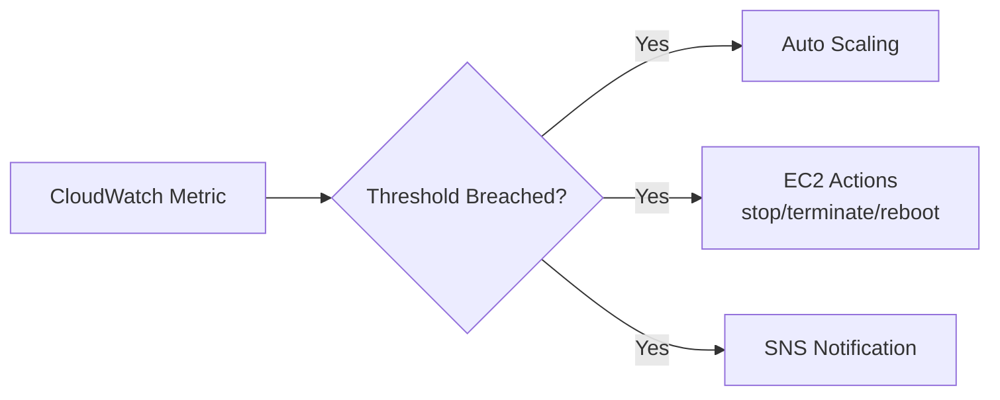
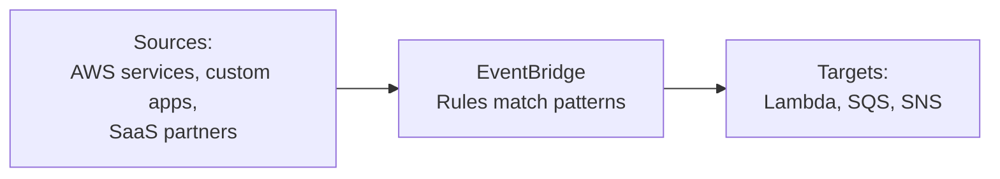
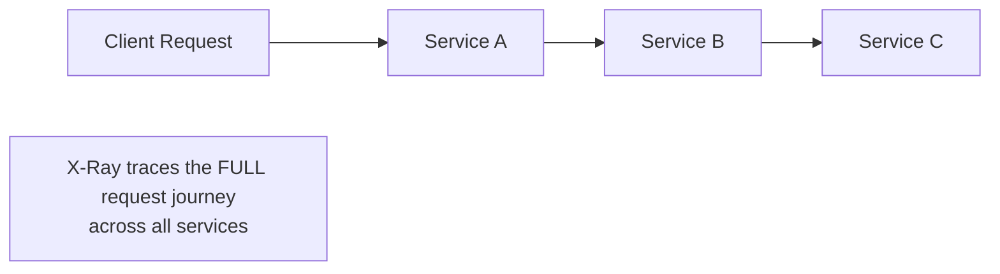
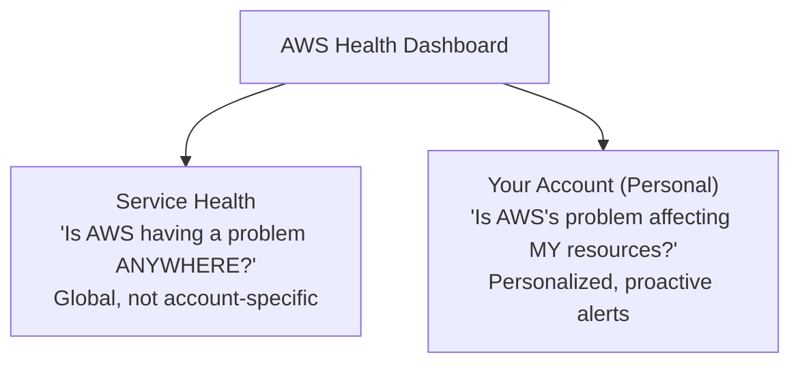
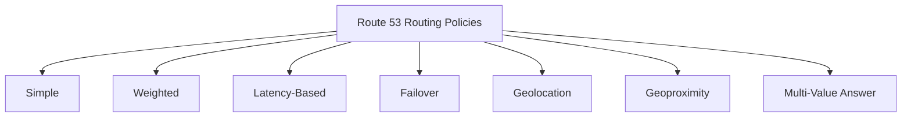
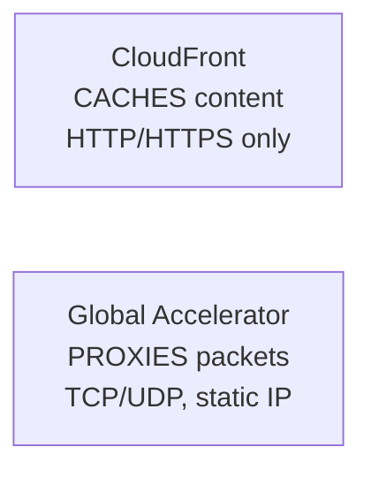
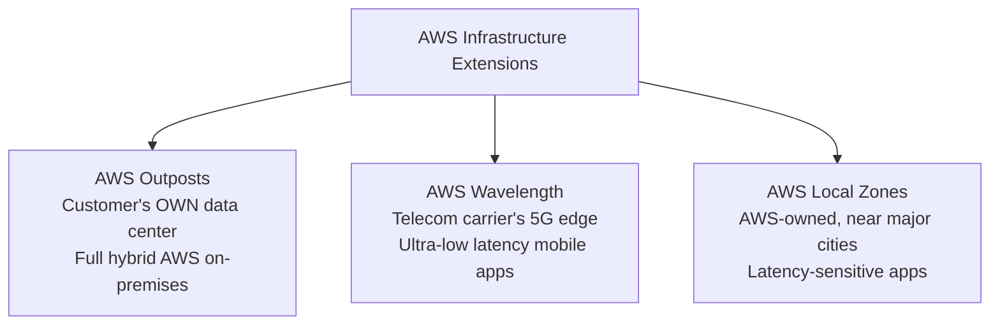
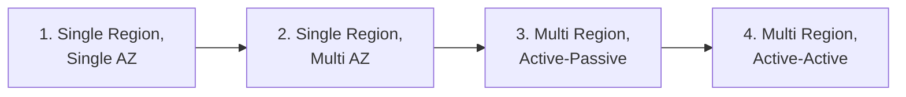

# Module 8: Monitoring, Observability & Global Infrastructure Services — Complete Study Summary

---

# PART A: Monitoring & Observability

## 1. CloudWatch Metrics

- Metrics for every AWS service — insights into resource utilization/performance
- **Metric** = time-ordered variable (CPU, network traffic, request count), each data point tagged with a timestamp

| Type | Interval | Cost |
|---|---|---|
| **Basic Monitoring** (default) | 5 minutes | Free |
| **Detailed Monitoring** (e.g., EC2) | 1 minute | Extra cost |

---

## 2. CloudWatch Alarms

- Watches a metric, triggers action when it crosses a **threshold**
- **Statistics:** Average, Sum, Minimum, Maximum, Sample Count
- **Evaluation period**: avoids false alarms from brief spikes

**Alarm states:** OK / ALARM / INSUFFICIENT_DATA

> **⚠️ Exam example:** Billing alarm on estimated charges — only available in **us-east-1 (N. Virginia)**, regardless of where resources run.

---

## 3. CloudWatch Logs

**Sources:** Elastic Beanstalk, ECS, **Lambda (automatic)**, CloudTrail (filtered), CloudWatch unified agent (EC2/on-prem), Route 53

**Retention:** Default = **Never expire**; configurable 1 day–10 years

> **⚠️ Key fact:** EC2 logs are **NOT automatic** — must install/configure **CloudWatch unified agent** + attach **IAM role**.
> Classic scenario: "Logs aren't showing up for my EC2 instance" → fix = install agent + attach IAM role, not a CloudWatch config issue.

---

## 4. Amazon EventBridge

- **Serverless event bus** — routes events between apps in near real time
- **Decouples** components: producer doesn't need to know consumer
- Example: S3 upload event → triggers Lambda via EventBridge, no direct wiring

> **⚠️ Exam tip:** EventBridge = modern evolution of "CloudWatch Events" (may still appear in older material/console labels)

---

## 5. AWS CloudTrail (Extended)

- Records **who did what, when, from where** (API calls, user actions)
- Enabled by default — **90-day free event history** in console
- For longer retention: create a **trail** → CloudWatch Logs or S3

> **⚠️ Critical distinction:**
> - **CloudTrail** = API calls/user actions ("who deleted this S3 bucket?")
> - **CloudWatch** = performance/operational metrics ("is CPU usage too high?")

---

## 6. AWS X-Ray

- **Distributed tracing** — follows one request across many microservices
- Helps: troubleshoot bottlenecks, understand dependencies, pinpoint failing service, find errors/exceptions

> **⚠️ Exam tip:** "Microservices" + "finding the bottleneck" → X-Ray (different from CloudWatch/CloudTrail)

---

## 7. Amazon CodeGuru

| Tool | Function | Status |
|---|---|---|
| **CodeGuru Reviewer** | Static code review during development | ⚠️ **Maintenance mode** (Nov 2025) — new needs → Amazon Q Developer / Inspector |
| **CodeGuru Profiler** | Runtime performance analysis in production | Fully active |

---

## 8. AWS Health Dashboard

| | **Service Health Dashboard** | **Your Account (Personal Health)** |
|---|---|---|
| Scope | Global, all AWS | Your specific resources |
| Example | "us-east-1 has an outage" | "This outage affects your EC2 instances" |

---

# PART B: AWS Global Infrastructure & Networking Services

## 9. AWS Global Infrastructure — Deep Dive

**Current scale:** 39+ Regions, 123+ AZs, 750+ Edge Locations

**Choosing a Region — 4 criteria:** Compliance, Proximity, Feature availability, Pricing

> **⚠️ Edge Locations do NOT run EC2 instances/databases** — caching/content delivery only.

---

## 10. AWS Route 53 — 8 Routing Policies

| Policy | Criteria | Health Check |
|---|---|---|
| **Simple** | Single resource, no logic | No |
| **Weighted** | Assigned weight values | Optional |
| **Latency-Based** | Lowest latency to user | Optional |
| **Failover** | Standby on primary failure | **Required** |
| **Geolocation** | Strict user location (country/continent) | Needs default record |
| **Geoproximity** | Location + bias value; needs Traffic Flow | - |
| **Multi-Value Answer** | Up to 8 healthy records, random | Yes |

> **⚠️ Key distinction:**
> - **Geolocation** = strict routing by user location (e.g., "all EU traffic → Frankfurt")
> - **Latency-based** = routes to best-performing Region, regardless of location
> - **Multi-Value Answer** ≠ load balancer replacement

---

## 11. AWS CloudFront

- CDN — content cached at edge locations
- Uses **Origin Access Control (OAC)** — replaces older OAI — restricts S3 access to CloudFront only
- Custom origins: ALB, EC2, S3 Website, any HTTP backend

### CloudFront vs. S3 Cross-Region Replication

| | **CloudFront** | **S3 CRR** |
|---|---|---|
| Update | Cached (TTL) | Near real-time |
| Access | Cached delivery | Read-only |
| Best for | Static content, global availability | Dynamic content, specific Region latency |

---

## 12. S3 Transfer Acceleration

- Speeds up **uploads/downloads to S3 itself** by 50-500% for long-distance transfers
- Routes through nearest CloudFront edge → AWS's private backbone
- Falls back to normal transfer (no fee) if already close to Region

> **⚠️ Exam trap:** Transfer Acceleration = speeds up transfer **to S3**; CloudFront = **caches and serves** already-stored content.

---

## 13. AWS Global Accelerator

- Improves availability/performance using AWS's global network instead of public internet
- **2 static Anycast IP addresses** — never update DNS when endpoints change
- Supports **TCP and UDP** (not just HTTP) — good for gaming, IoT, VoIP

### CloudFront vs. Global Accelerator — Final Comparison

| | **CloudFront** | **Global Accelerator** |
|---|---|---|
| Mechanism | Caches content | Proxies packets, no caching |
| Protocol | HTTP/HTTPS only | TCP/UDP |
| Best for | Cacheable web content | Non-HTTP protocols, static IP needs |

> **⚠️ Quick rule:** Caching static content → CloudFront. Non-HTTP protocol or static IP → Global Accelerator.

---

## 14. Extending AWS to New Locations

| | **AWS Outposts** | **AWS WaveLength** | **AWS Local Zones** |
|---|---|---|---|
| Hardware location | Customer's data center | Telecom carrier's 5G network | AWS-owned, near metros |
| Purpose | Full hybrid cloud on-prem | Ultra-low latency 5G apps | Latency-sensitive apps near population centers |
| Runs compute? | Yes (full AWS stack) | Yes | Yes |

> **Key distinction from Edge Locations (CloudFront):** Edge Locations are caching-only (no compute); Local Zones/Outposts/WaveLength run actual **EC2/compute**.

---

## 15. AWS Global Applications Architecture — 4 Patterns

| Pattern | HA | Global Read Latency | Global Write Latency | Difficulty |
|---|---|---|---|---|
| **1. Single Region, Single AZ** | ❌ | ❌ | ❌ | 🟢 Lowest |
| **2. Single Region, Multi AZ** | ✅ | ❌ | ❌ | 🟠 Medium |
| **3. Multi Region, Active-Passive** | ✅ | ✅ | ❌ (writes → primary only) | 🟠 Medium |
| **4. Multi Region, Active-Active** | ✅ | ✅ | ✅ | 🔴 Highest |

> **⚠️ Exam tip:** Progression = increasing resilience + decreasing latency, but increasing operational overhead (especially write consistency). **Active-Active = best availability but hardest/most expensive** to implement correctly.

Real-world examples: Active-Passive ≈ RDS Multi-Region Read Replicas; Active-Active ≈ DynamoDB Global Tables.

---

## Quick Reference — Module 8 Exam Anchors

| If the question says... | Think... |
|---|---|
| "Billing alarm, works in what Region?" | us-east-1 only |
| "EC2 logs not showing in CloudWatch" | Missing CloudWatch agent + IAM role |
| "Decouple services via events" | EventBridge |
| "Who did what, when" | CloudTrail |
| "Trace a request across microservices" | X-Ray |
| "Static code review" (historical) | CodeGuru Reviewer (now Q Developer) |
| "Runtime performance analysis" | CodeGuru Profiler |
| "Is AWS having a problem anywhere?" | Service Health Dashboard |
| "Is this outage affecting MY resources?" | Personal Health Dashboard |
| "All EU traffic must go to Frankfurt" | Geolocation routing |
| "Best-performing Region regardless of location" | Latency-based routing |
| "Speed up uploads to S3" | Transfer Acceleration |
| "Cache and serve web content" | CloudFront |
| "Gaming/VoIP/IoT, needs static IP" | Global Accelerator |
| "Run AWS fully inside my own data center" | Outposts |
| "Ultra-low latency tied to 5G" | Wavelength |
| "Best availability, hardest to implement" | Multi-Region Active-Active |
