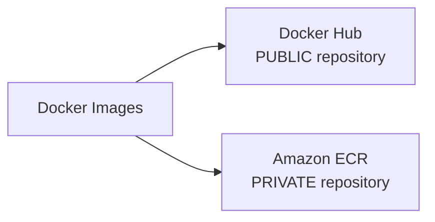
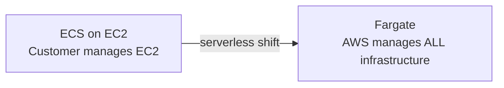
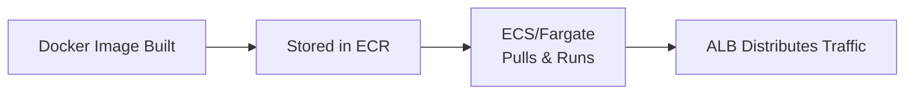
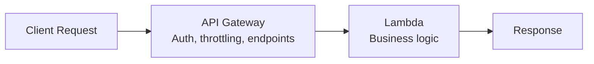
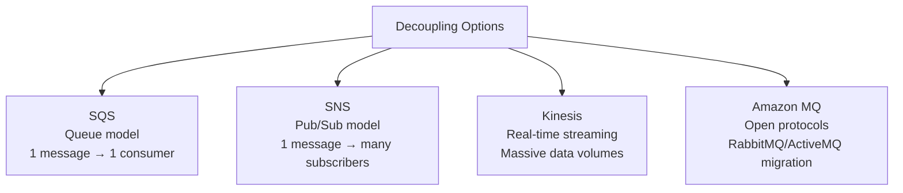

# Module 9 (Part 1): Containers, Serverless & Application Integration — Study Summary

---

## 1. Docker

- Platform for packaging apps into **containers** that run on any OS
- Consistent behavior, no compatibility issues, rapid scaling (seconds)

| Repository | Type | Example |
|---|---|---|
| **Docker Hub** | Public | Ubuntu, MySQL, NodeJS base images |
| **Amazon ECR** | Private | Your own secured images |

---

## 2. ECS (Elastic Container Service)

- Launches Docker containers on AWS
- **Customer** provisions/maintains infrastructure (EC2 instances)
- **AWS** starts/stops containers
- Integrates with **Application Load Balancer**

---

## 3. AWS Fargate

- **Serverless** launch type for ECS (or EKS) — no EC2 management needed
- AWS runs containers automatically based on specified CPU/RAM

| | **ECS (EC2 launch type)** | **Fargate (launch type)** |
|---|---|---|
| EC2 management | Customer | AWS (fully) |
| You configure | Instance type/size | CPU/RAM requirements |

> **⚠️ Exam tip:** "Run containers without managing any EC2 instances" → Fargate

---

## 4. Amazon ECR

- **Private Docker registry** — securely stores images for ECS/Fargate to pull and run

**Complete container workflow:**

---

## 5. Serverless — The Concept

> "Serverless" does NOT mean absence of servers — it means servers are **managed by the provider**, invisible to developers.

- Originally synonymous with **FaaS** (Function as a Service)
- Pioneered by **AWS Lambda**; now includes DynamoDB, Aurora Serverless, Fargate, Athena, etc.

---

## 6. AWS Lambda

- Eliminates need for provisioning/managing servers
- Triggers functions in response to **events**
- **Time-limited** execution; **auto-scales**; pay only for compute time used, no idle cost
- Up to **10GB RAM** per function

### Lambda Pricing
| Type | Free tier | After free tier |
|---|---|---|
| **Per call** | First 1,000,000 requests free | $0.20 per 1M requests |
| **Per duration** | 400,000 GB-seconds/month free | $1.00 per 600,000 GB-seconds |

---

## 7. Amazon API Gateway

- Fully managed, serverless API management — RESTful & WebSocket APIs
- Includes: security, authentication, **throttling**, API keys, monitoring

**Common pattern:**

---

## 8. AWS Batch vs. Lambda

| | **AWS Batch** | **Lambda** |
|---|---|---|
| Execution time | **No limit** | **Time-limited** |
| Runtime | Any (Docker image) | Specific runtimes only |
| Disk space | EBS or instance store | Limited temp space |
| Infrastructure | EC2 (self/AWS-managed) | **Fully serverless** |

- Batch jobs defined as Docker images, run on ECS; dynamically uses EC2/Spot Instances

---

## 9. AWS Lightsail

- Simplified virtual servers/storage/DBs/networking — **predictable pricing**
- Ideal for beginners; templates for WordPress, LAMP, Node.js, etc.
- **Lacks auto-scaling**; limited AWS integrations

---

## 10. Application Integration — Decoupling Services

### Amazon SQS
- Fully managed, serverless queue; scales 1/sec to 10,000s/sec
- Retention: default 4 days, max 14 days
- Latency < 10ms; consumers share workload = horizontal scaling
- **FIFO** = First In First Out ordering

### Amazon Kinesis
| Component | Function |
|---|---|
| **Data Streams** | Low-latency ingestion at scale |
| **Data Firehose** | Loads into S3, Redshift, ElasticSearch |
| **Data Analytics** | Real-time SQL analytics on streams |
| **Video Streams** | Real-time video monitoring/ML |

### Amazon SNS
- **Pub/Sub** — one message to many subscribers; each gets ALL messages
- Limits: 12,500,000 subscriptions/topic, 100,000 topics max

### Amazon MQ
- Managed broker for **open protocols** (MQTT, AMQP, STOMP): for migrating **RabbitMQ/ActiveMQ** apps
- Doesn't scale as much as SQS/SNS — runs on servers, Multi-AZ failover
- Offers BOTH queue (SQS-like) AND topic (SNS-like) features

### Quick Decision Table
| Scenario | Answer |
|---|---|
| Decouple two apps, one consumer | SQS |
| One message to many subscribers | SNS |
| Massive real-time data (video, IoT) | Kinesis |
| Migrate on-prem RabbitMQ/ActiveMQ app | Amazon MQ |

---

## Quick Reference — Part 1 Exam Anchors

| If the question says... | Think... |
|---|---|
| "Run Docker containers, no EC2 management" | Fargate |
| "Private Docker image storage" | Amazon ECR |
| "Serverless" definition | Servers managed by provider, invisible to devs |
| "Event-driven, short execution, no server mgmt" | Lambda |
| "REST API with throttling and auth" | API Gateway |
| "No execution time limit, any runtime" | AWS Batch |
| "Beginner, predictable pricing, simple website" | Lightsail |
| "Fan out one message to many recipients" | SNS |
| "Reliable single-consumer message queue" | SQS |
| "Real-time massive data streaming" | Kinesis |
| "Migrate existing RabbitMQ app to cloud" | Amazon MQ |
