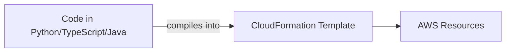
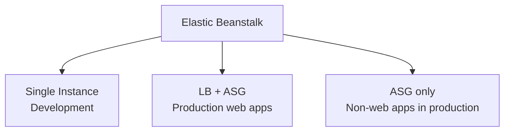
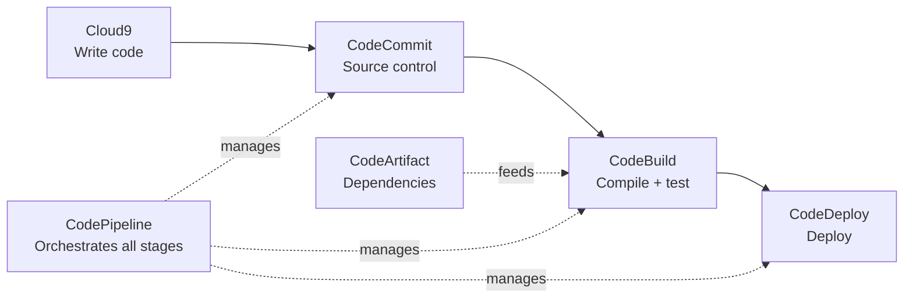

# Module 9 (Part 2): Infrastructure as Code & CI/CD Developer Tools — Study Summary

---

## 1. AWS CloudFormation

- Models/provisions/manages AWS + third-party resources as **Infrastructure as Code**
- Creates resources in specified order with defined config

**5 Benefits:**
1. **Infrastructure as Code** — no manual creation, changes reviewed via code
2. **Don't reinvent the wheel** — use existing templates/documentation
3. **Productivity** — easy destroy/recreate, auto-diagrams, **declarative** (no orchestration worry)
4. **Cost** — tagged resources for tracking, cost estimation, scheduled dev-env teardown
5. **Supports almost all AWS resources** — custom resources for gaps

---

## 2. AWS CDK (Cloud Development Kit)

- Accelerates development using **real programming languages**
- Code compiles into a CloudFormation template
- Can deploy **infrastructure AND application code together** (Lambda, containers)

> **⚠️ CDK ≠ replacement for CloudFormation** — it's a tool that generates CloudFormation templates.

---

## 3. Elastic Beanstalk

- **Managed service** — sets up instance/OS, handles deployment
- Developer responsibility: **ONLY the application code**

**Health Monitoring:** health agent pushes metrics to CloudWatch, publishes health events.

> Uses CloudFormation under the hood.

---

## 4. AWS CI/CD Pipeline — Full Overview

| Service | Role |
|---|---|
| **AWS Cloud9** | Cloud IDE — write/debug code in browser |
| **AWS CodeCommit** | Source control — private Git repos (up to 5,000 repos) |
| **AWS CodeArtifact** | Stores/retrieves dependencies (external libraries) |
| **AWS CodeBuild** | Compiles code, runs tests, produces deployable packages |
| **AWS CodeDeploy** | Automates deployment to compute services (hybrid — AWS + on-prem) |
| **AWS CodePipeline** | Orchestrates the entire pipeline automatically |

### CodeDeploy Detail
- **Hybrid service** — servers must be pre-configured with **CodeDeploy Agent**
- Use cases: automate deployments, deploy to many hosts, advanced techniques (blue/green), rollback

### CodeCommit Detail
- Secure, scalable, private Git repos
- ⚠️ **History:** Closed to new customers July 2024 → **reopened Nov 25, 2025**

### CodePipeline Detail
- Builds/tests/deploys code **every time there's a change**
- Uses **stages** (build/test/deploy); each stage has **actions** that must complete before moving on

---

## 5. AWS Systems Manager (SSM)

- Manages EC2 + **on-premises** systems at scale (hybrid service)
- Operational insights, automated patching, run commands across a fleet

### SSM Parameter Store
- Safe storage for settings/confidential info (API keys, passwords, configs)
- Access via IAM; optional versioning/encryption

| | **Secrets Manager** | **SSM Parameter Store** |
|---|---|---|
| Auto rotation | ✅ Yes | ❌ No |
| Cost | Paid per secret | Free (Standard tier) |
| Best for | Sensitive secrets needing rotation | General settings, no rotation needed |

---

## Full Development Lifecycle Recap

| Stage | Service | Role |
|---|---|---|
| **Write** | Cloud9 | Cloud IDE |
| **Store** | CodeCommit | Source control |
| **Dependencies** | CodeArtifact | Package repository |
| **Build** | CodeBuild | Compile/test/package |
| **Deploy** | CodeDeploy | Automated deployment |
| **Orchestrate** | CodePipeline | Ties all stages together |
| **Manage Infra** | CloudFormation / CDK | Infrastructure as Code |
| **Simplify Web Apps** | Elastic Beanstalk | Managed app deployment |
| **Ongoing Ops** | Systems Manager | Fleet management, patching, parameters |

---

## Quick Reference — Part 2 Exam Anchors

| If the question says... | Think... |
|---|---|
| "Define infra as declarative JSON/YAML" | CloudFormation |
| "Define infra using a real programming language" | CDK |
| "Focus on code only, AWS handles LB/ASG/monitoring" | Elastic Beanstalk |
| "Cloud IDE, write code in browser" | Cloud9 |
| "Private Git repository hosting" | CodeCommit |
| "Store external library dependencies" | CodeArtifact |
| "Compile code, run tests, produce package" | CodeBuild |
| "Automate deployment with blue/green rollback" | CodeDeploy |
| "Orchestrate the entire release pipeline" | CodePipeline |
| "Manage EC2 + on-premises servers at scale" | Systems Manager |
| "Store settings/secrets, no rotation, free" | SSM Parameter Store |
| "Store secrets WITH automatic rotation" | Secrets Manager |
