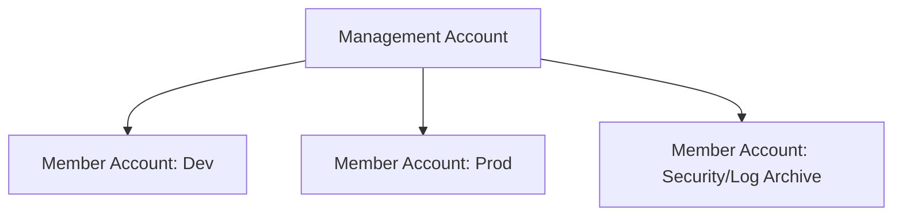
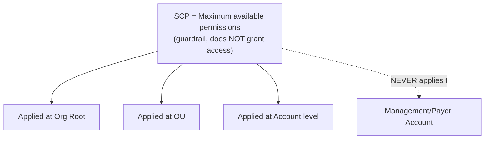
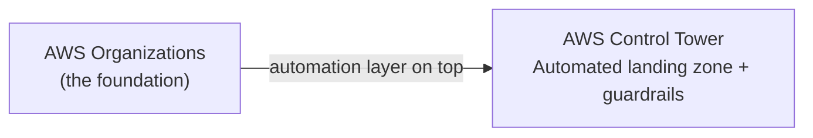
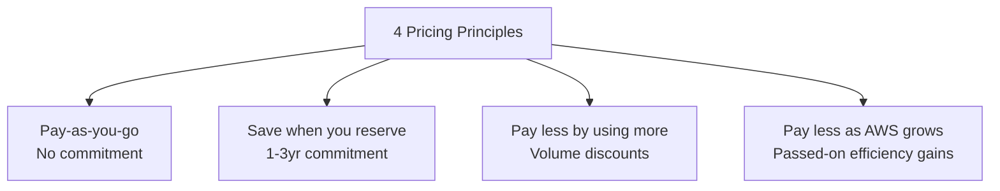
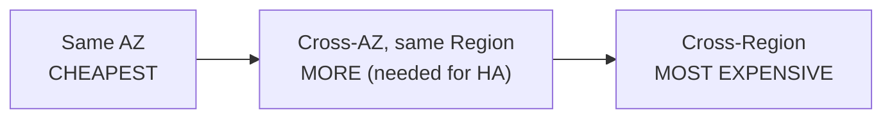
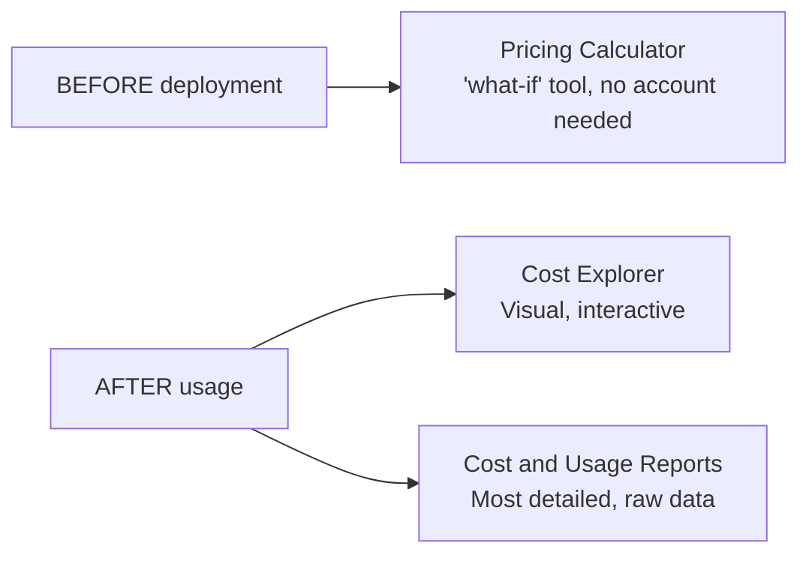

# Module 9 (Part 3): AWS Organizations & Cost Management — Study Summary

---

# PART A: AWS Organizations

## 1. AWS Organizations

- Consolidates multiple AWS accounts into a centrally managed organization
- **Management account** ("master account") creates/manages all others

**Cost Benefits:**
- **Consolidated billing** — single invoice, pooled usage → volume discounts
- RI/Savings Plans discount sharing across accounts

### Multi-Account Strategy Best Practices
- Separate accounts per department/environment — **account isolation = strongest blast-radius boundary**
- Dedicated **Log Archive account** (write/delete restricted) protects audit trails
- Standardize tagging; enable CloudTrail everywhere → central S3 bucket

> **⚠️ Exam tip:** Isolating environments/incidents/billing by department → **multi-account under Organizations**, not IAM policies or VPCs alone.

---

## 2. Organizational Units (OUs) & Service Control Policies (SCPs)

- **SCPs** = organization-wide **permission guardrails** — set MAX available permissions, don't grant access
- Applied at: Org root, OU, or individual account
- **Never applies to the management (payer) account**
- Affects ALL IAM Users/Roles in member account, **including root user**
- Need: IAM/resource Allow **AND** no SCP Deny → to perform an action

> **⚠️ Exam tip:** Restricting root user or blocking a whole account from a service → **SCP**, not IAM policy (IAM policies can't touch root, live in one account only)

**Resource Control Policies (RCPs)** — newer sibling: SCPs restrict what a *principal* can do; RCPs restrict what can be done *to a resource* (e.g., S3 bucket only accessible by org members).

---

## 3. AWS Control Tower

| | **AWS Organizations** | **AWS Control Tower** |
|---|---|---|
| Level | Basic account/billing management | Higher-level automation |
| Setup | Manual (OUs, SCPs yourself) | Automatic landing zone in minutes |
| Extras | — | Configuration drift detection, dashboard |

> Control Tower **requires** Organizations underneath; Organizations doesn't require Control Tower.

---

## 4. AWS Resource Access Manager (RAM)

- Shares **existing** AWS resources across accounts/OUs **without duplicating**
- Supports: VPC subnets, Transit Gateways, Route 53 Resolver rules, Dedicated Hosts, Aurora clusters, IPAM pools
- Access still governed by IAM policies — sharing doesn't bypass access control

> **Example:** Central networking account shares one Transit Gateway with 10 app accounts, instead of each building its own.

---

# PART B: Pricing & Cost Management

## 5. AWS Pricing — 4 Core Principles

**Free management services** (pay only for underlying resources): IAM, VPC, Organizations, Elastic Beanstalk, CloudFormation, Auto Scaling.

### AWS Free Tier (changed July 15, 2025)
| | **Legacy accounts** (before July 15, 2025) | **New accounts** (on/after) |
|---|---|---|
| Model | Always Free + 12-month + trials | Credit-based Free/Paid Plan |
| Credits | None | $100 signup + up to $100 more |
| Duration | 12 months | 6 months or until credits exhausted |

**Always Free services** (Lambda, DynamoDB, SNS) remain free regardless of account type.

---

## 6. Savings Plans — 4 Types

| Type | Max Discount | Flexibility | Term |
|---|---|---|---|
| **EC2 Instance** | 72% | Locked to family + Region | 1-3yr |
| **Compute** | 66% | Most flexible — any family/OS/Region + Fargate/Lambda | 1-3yr |
| **SageMaker** | 64% | Any ML instance type | 1-3yr |
| **Database** | 35% | Very flexible across DB engines/instances | **1yr only, no-upfront** |

> **⚠️ Exam tip:** Savings Plans commit to **$/hour spend** (flexible); Reserved Instances commit to a **specific instance config**.

---

## 7. Storage & Database Pricing Highlights

### S3 Pricing Factors
Object count/size (tiered), request type, **data transfer OUT** (IN is free), Transfer Acceleration fee, lifecycle transitions.

### EBS Pricing
| Type | Model | Best For |
|---|---|---|
| gp3/gp2 | Baseline included + optional extra fee | General use |
| io2/io1 | Pay separately for IOPS | High-performance DBs |
| st1/sc1 | Per GB, no IOPS charge | Sequential big data |

### RDS Pricing
- Billed per hour/second: engine + instance class + purchase type
- **Multi-AZ roughly doubles** storage/I/O cost vs. Single-AZ (data duplicated to standby)
- Automated backups free up to 100% of provisioned storage

### Data Transfer Cost Ranking

> **⚠️ Trade-off:** Single AZ minimizes cost but sacrifices fault tolerance; Multi-AZ is the resilient (exam-recommended) design despite higher cost.

---

## 8. Estimating & Tracking Costs

| Tool | When | Purpose |
|---|---|---|
| **Pricing Calculator** | Before deployment | Estimate costs, no AWS account needed |
| **Cost Explorer** | After usage | Visual/interactive trend analysis, forecasts up to 12 months |
| **Cost and Usage Reports (CUR)** | After usage | Most granular line-item data, for Athena/Redshift/QuickSight |

**Cost Allocation Tags:** AWS-generated (`aws:` prefix, automatic) vs. User-defined (`user:` prefix, must be activated).

> **⚠️ Exam tip:** Custom analysis/data warehouse needs → **CUR**, not Cost Explorer (built for visual exploration).

---

## 9. Monitoring Costs

| Tool | Purpose | Cost |
|---|---|---|
| **CloudWatch Billing Alarm** | Simple total-spend threshold (**us-east-1 only**) | Free |
| **AWS Budgets** | 4 types (Cost/Usage/RI/Savings Plan), forecasted or actual | Monitoring free; actions after first 2 = $0.10/day |
| **Cost Anomaly Detection** | ML detects UNEXPECTED spend, no fixed threshold | Free |
| **Service Quotas** | Alerts before hitting service limits | Free |
| **Trusted Advisor** | Best-practice checks (6 categories) | Basic = limited; **Business Support+** = full |

> **⚠️ Exam tip:**
> - "Unexpected/unusual spending, no threshold set" → Cost Anomaly Detection
> - "Alert when spend crosses $X I defined" → AWS Budgets

### Trusted Advisor — 6 Categories
Cost optimization, Performance, Security, **Resilience** (formerly "Fault Tolerance"), Operational Excellence, Service Limits.

---

## Quick Reference — Part 3 Exam Anchors

| If the question says... | Think... |
|---|---|
| "Restrict root user account-wide" | SCP |
| "Automated multi-account landing zone in minutes" | Control Tower |
| "Share existing Transit Gateway across accounts" | AWS RAM |
| "$/hour flexible commitment" | Savings Plans |
| "Specific instance config commitment" | Reserved Instances |
| "Estimate cost before building anything" | Pricing Calculator |
| "Visualize spending trends interactively" | Cost Explorer |
| "Most granular raw billing data for analysis" | Cost and Usage Reports |
| "Unexpected spending spike, no threshold" | Cost Anomaly Detection |
| "Alert when spend crosses $X" | AWS Budgets |
| "Best-practice checks across account" | Trusted Advisor |
