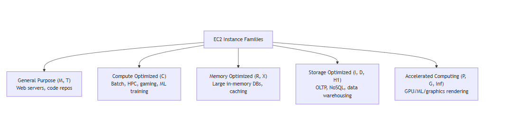
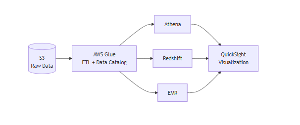
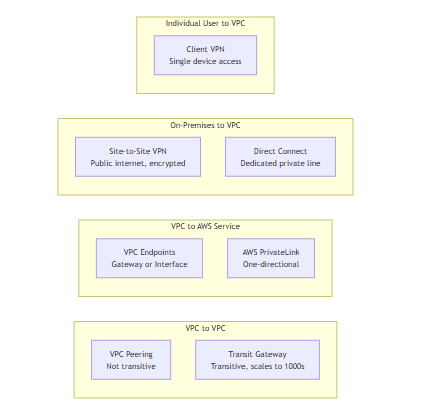

# AWS Cloud Computing Fundamentals - Comprehensive Visual Summaries

Welcome to my AWS learning journey repository! This repository serves as a highly structured, premium study guide and documentation asset. It contains my personal, meticulously crafted summaries for the **Manara AWS Track** (Intro to Cloud Computing Learning Path). 

Every module has been summarized focusing on exact technical accuracy, core architectural principles, and high-yield exam insights.

---

##  Why This Repository Stands Out

Unlike generic text notes, these summaries are built as an **exam-oriented, engineering-first documentation**:
* **Mind Maps & Flowcharts:** Simplifies complex workflows like Traditional IT vs. Cloud Economies, Traffic Routing, and Security boundaries.
* **Comparison Matrixes:** Structured tables comparing Pricing Models, Service tiers, and Architectural advantages.
* **High-Yield Exam Tips:** Highlights exact keywords (*On-demand, Elasticity, Agility, Pay-as-you-go*) mapped directly to AWS certification questions.

---

##  Visual Preview of the Summaries

Here is a look inside some of the architectural diagrams and mind maps included in the modules:

### 💻 1. EC2 Instance Families Breakdown

  

### 🔄 2. End-to-End Data Pipeline Architecture

  

### 🌐 3. VPC Connectivity & Networking Options

  

---

##  Curriculum Structure & Module Breakdown

The repository is organized to follow the comprehensive syllabus of the AWS Manara learning track, mapping 10 core modules:

###  Section 1: Cloud & Compute Foundations
* **AWS-01: Cloud Computing Fundamentals and Concepts**
  * Core concepts, the 6 official advantages of Cloud Computing, and Global Infrastructure Overview.
* **AWS-02: AWS Core Services (EC2 Instances)**
  * Amazon Elastic Compute Cloud (EC2) instances types, lifecycle, configuration, and EBS storage pairing.

###  Section 2: Scaling & Networking
* **AWS-03: Virtual Private Cloud (VPC) Fundamentals**
  * Subnets (Public/Private), Internet Gateways, Route Tables, and Network Access Control Lists (NACLs) vs. Security Groups.
* **AWS-04: Elastic Load Balancing (ELB) & Auto-Scaling Groups (ASG)**
  * High Availability design, decoupling architectures, Application vs. Network Load Balancers, and dynamic scaling policies.

###  Section 3: Storage & Data Management
* **AWS-05: Amazon S3 (Simple Storage Service)**
  * Object storage basics, bucket policies, storage classes (Standard, Intelligent-Tiering, Glacier), and lifecycle management.
* **AWS-06: Database Fundamentals**
  * Relational vs. Non-Relational database architectures, Amazon RDS, Amazon DynamoDB, and use-case selection.

###  Section 4: Governance, Security & Management
* **AWS-07: Security and Compliance**
  * The AWS Shared Responsibility Model, AWS IAM (Identity and Access Management), users, groups, roles, and compliance tracking.
* **AWS-08: Cloud Technology and Services**
  * Core technology ecosystem, automation, and management tools.
* **AWS-09: Billing, Pricing, and Support**
  * AWS Cost Explorer, Budgets, Pricing Calculator, and technical Support Plans (Basic, Developer, Business, Enterprise).
* **AWS-10: Further AWS Services**
  * High-level overview of advanced services including serverless components, messaging, and analytical tools.

---

##  Target Certifications Aligned

The depth of these visual notes directly prepares readers and maps to the official exam domains of:
1. **AWS Certified Cloud Practitioner (CLF-C02)**
2. **AWS Certified Solutions Architect – Associate (SAA-C03)** (Core infrastructure fundamentals)

---

##  Connect & Collaborate

If you find these notes helpful for your study or revision, feel free to drop a ⭐ and connect with me!

* **Author:** Samar Mahmoud
* **GitHub:** [@SamarMahmoud10](https://github.com)
* **LinkedIn:** https://www.linkedin.com/in/samar-mahmoud-1a4b1228a/

---
_Disclaimer: These materials are personal study notes created during the Manara program to synthesize complex knowledge into production-grade documentation. All AWS logos and service definitions belong to Amazon Web Services._
